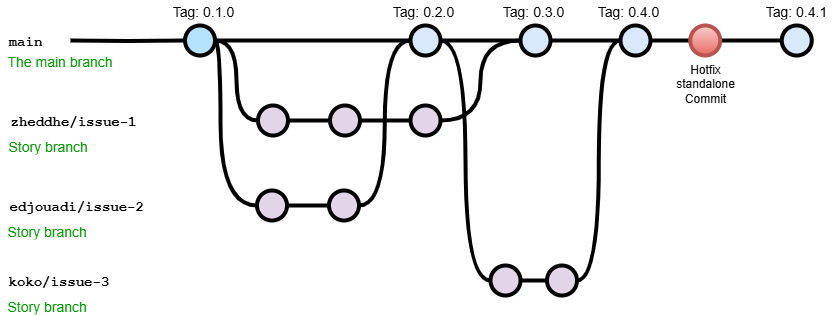

# 🚲 Cyclist Traffic MLOPS Project

[](https://github.com/zheddhe/avr25-mle-trafic-cycliste/actions)
[](https://github.com/zheddhe/avr25-mle-trafic-cycliste/actions)

> A machine learning pipeline to provide bike traffic prediction in Paris.  
> Developed as part of the April 2025 Machine Learning Engineering (MLE) full training program.

---

## 🧭 Overview

This project implements a full machine learning and MLOps pipeline in three main stages:

### 1. 📐 Data Product Management

- Define business goals
- Scope the data lifecycle

### 2. 📊 Data Science

- Data collection and preprocessing
- Model development and evaluation
- Time series prediction

### 3. ⚙️ MLOps

- Reproducibility and continuous testing
- Containerization with micro services
- Security awareness
- Monitoring and orchestration
- Scalability

---

## 🧱 Project Structure

``` text
avr25-mle-trafic-cycliste/
├── LICENSE            <- MIT license
├── README.md          <- The top-level README for developers using this project.
├── pyproject.toml     <- The environment context for reproducing the project environment (with UV)
├── flake8             <- Linter configuration rules
├── data
│   ├── processed      <- Intermediate data that has been transformed.
│   ├── final          <- Final transformed data and predictions used by model training and forecasting.
│   └── raw            <- The original, immutable data dump.
├── logs               <- Logs from training and predicting
│   └──...
├── models             <- Trained and serialized models including their best params and transformers
│   └──...
├── notebooks          <- Jupyter notebooks. Naming convention is a number (for ordering),
│   └──...                the creator's initials, and a short `-` delimited description, e.g.
│                         `1.0-jqp-initial-data-exploration`.
├── references         <- Data dictionaries, manuals, and all other explanatory materials.
│   └──...
├── reports            <- Generated analysis as HTML, PDF, LaTeX, etc.
│   └── figures        <- Generated graphics and figures to be used in reporting
│       └──...
├── src                <- Source code for use in this project.
│   ├── __init__.py    <- Makes src a Python module
│   ├── common         <- common functions reusable between each stage
│   │   ├── __init__.py
│   │   ├── modeling_util.py 
│   │   └── preprocessing_util.py
│   ├── data           <- Scripts to download or generate data
│   │   ├── __init__.py
│   │   ├── import_raw_data.py 
│   ├── features       <- Scripts to turn raw data into features for modeling
│   │   ├── __init__.py
│   │   └── build_features.py
│   ├── models         <- Scripts to train models and then use trained models to make predictions
│   │   ├── __init__.py
│   │   └── train_and predict.py
│   ├── visualization  <- Scripts to create exploratory and results oriented visualizations
│   │   └── visualize.py
├── tests/             <- Unit tests (pytest for src source code)
├── LICENSE                 # MIT license
├── pyproject.toml          # Python project configuration
└── noxfile.py              # NOX session configuration
```

---

## ⚙️ Installation

### 🔧 Initial Setup (One-time bootstrap)

```bash
# The build env initialization requires python, pipx, nox, uv as a bootstrap
python --version # check python is here if not install it manually depending on your OS
python -m pip install --upgrade pip
python -m pip install --user pipx
pipx ensurepath # propagate pipx temporary bootstrap virtual env to PATH if not already done
pipx install nox uv # set up NOX (session manager like a MAKE multi OS) and UV (fast virtual env back end)
```

### 🚀 Day-to-day Usage

```bash
# Rebuild and complete virtual env for standard streamlit application and notebooks with pytorch (+ trigger test/flake8)
nox -s build

# Activate the virtual env in command line based on your OS (and preferrably add it in your IDE as the interpreter)
.nox\build\Scripts\activate.bat # cmd shell windows only
# or
source .nox/build/bin/activate # cmd shell Mac/Linux only

# Optional: cleanall (project generated file and virtual envs)
nox -s cleanall
```

---

## 🧪 Testing and Continuous Integration

Tests are executed using `pytest`, including:

- ✅ Unit tests for each modules (`trafic/`)  

CI workflows are handled by GitHub Actions:

- `ci_main.yml`: runs on every push or pull request to the `main` branch  
- `ci_branch.yml`: runs on every push to any other branch

---

## 👥 Collaborative branch workflow

Based on [jbenet/simple-git-branching-model.md](https://gist.github.com/jbenet/ee6c9ac48068889b0912) and illustrated below

- Create branch per story/bugfix and merge them with pull requests afterward
- Tag stable versions ideally after each story/bugfix successfull merge



---

## 👥 Contributors

- Rémy Canal – [@remy.canal](mailto:remy.canal@live.fr)  
- Elias Djouadi – [@elias.djouadi](mailto:elias.djouadi@gmail.com)
- Koladé Houessou – [@kolade.houessou](mailto:koladehouessou@gmail.com)
