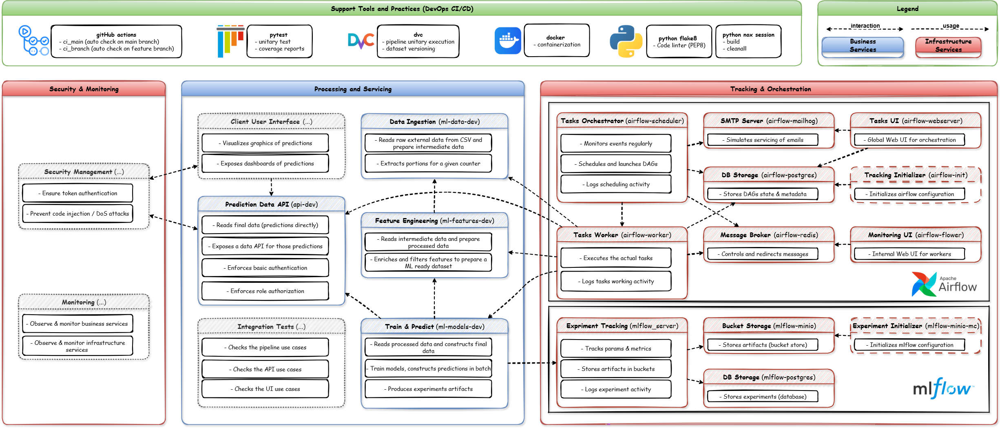
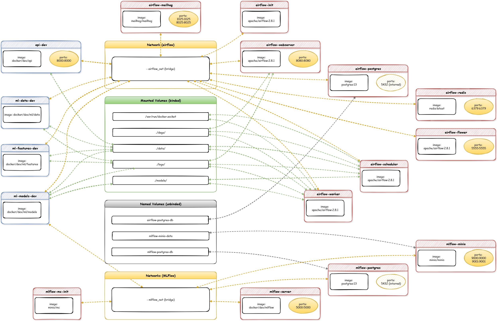
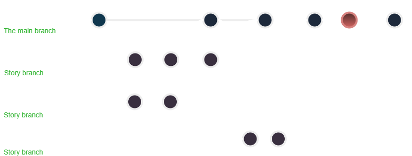

# 🚲 Cyclist Traffic MLOPS Project

[](https://github.com/zheddhe/avr25-mle-trafic-cycliste/actions)
[](https://github.com/zheddhe/avr25-mle-trafic-cycliste/actions)

> A machine learning pipeline to provide bike traffic prediction in Paris.  
> Developed as part of the April 2025 Machine Learning Engineering (MLE) full training program.

## 🧭 Overview

This project implements a complete machine learning and MLOps architecture in three main stages:

### 1. 📐 Data Product Management

- Define business goals
- Scope the data lifecycle

### 2. 📊 Data Science

- Data collection and preprocessing
- Model development and evaluation
- Time series prediction

### 3. ⚙️ MLOps

- Reproducibility and continuous testing
- Containerization with microservices
- Security awareness
- Monitoring and orchestration
- Scalability

> The MLOps architecture we designed focuses on interactions between components
> to achieve our main business case: an external user can access daily refreshed
> bike traffic predictions.

[](https://drive.google.com/file/d/1aglCRFaxXRVEEEwtE5ePFnW-vjE8CYa-/view?usp=sharing)

## 🧱 GitHub Structure

```text
avr25-mle-trafic-cycliste/
├── LICENSE             <- MIT license
├── README.md           <- This top-level README for developers using this project
├── flake8              <- Linter configuration rules
├── pyproject.toml      <- Python development project configuration
├── uv.lock             <- UV lockfile for the dev environment
├── noxfile.py          <- Nox dev sessions (build/clean)
├── data                <- Data storage
│   ├── raw             <- Original, immutable data dumps (e.g., external sources)
│   ├── interim         <- Intermediate data derived from raw (goal-specific)
│   ├── processed       <- Processed data (e.g., feature-enriched)
│   └── final           <- Final stage data (e.g., train/test and predictions)
├── logs                <- Logs from training and prediction
│   └── ...
├── models              <- Trained/serialized models, best params, transformers
│   └── ...
├── references          <- Data dictionaries, manuals, other explanatory material
│   └── ...
├── src/                <- All source code used in this project
│   ├── api/            <- FastAPI service (prediction readout)
│   │   └── main.py
│   └── ml/             <- Machine learning pipeline
│       ├── ingest      <- Scripts to ingest initial raw data or daily data
│       │   ├── data_utils.py
│       │   └── import_raw_data.py
│       ├── features    <- Scripts to turn raw data into modeling-ready data
│       │   ├── features_utils.py
│       │   └── build_features.py
│       └── models      <- Train models and compute batch predictions
│           ├── models_utils.py
│           └── train_and_predict.py
├── docker/             <- Container architecture
│   ├── dev/            <- Development setup
│   │   ├── api/
│   │   │   ├── requirements.txt
│   │   │   └── Dockerfile
│   │   └── ml/
│   │   │   ├── requirements.txt
│   │   │   └── Dockerfile
│   └── prod/           <- Production setup
│       └── ...
└── tests/              
    ├── unitary/        <- Unit tests (pytest for source code coverage)
    │   └── ...
    └── integration/    <- integration tests (pytest for integration test)
        └── ...
```

## ⚙️ Installation

### 🔧 Prerequisites

Initialize the build environment with Python, pipx, Nox, and UV.

```bash
# Check Python is installed (install it manually if needed, depending on your OS)
python --version

# Install pipx and add it to PATH
python -m pip install --upgrade pip
python -m pip install --user pipx
pipx ensurepath

# Install Nox (multi-OS session runner) and UV (fast virtual env + resolver)
pipx install nox uv
```

### 🔧 Repository cloning and DVC setup (One-time init)

Please refer to DagsHub remote setup actions. Example steps:

- Git cloning

```bash
git clone https://github.com/zheddhe/avr25-mle-trafic-cycliste.git
```

- DVC setup

```bash
dvc remote add origin s3://dvc
dvc remote modify origin endpointurl   https://dagshub.com/zheddhe/avr25-mle-trafic-cycliste.s3

dvc remote modify origin --local access_key_id [...]
dvc remote modify origin --local secret_access_key [...]
```

## 🚀 DevOps setup

> This section covers the project setup as a monolithic architecture from a DevOps point of view.

```bash
### Rebuild a complete virtual dev env (runs flake8 and pytest)
nox -s build

### Activate the virtual environment in a command-line session (per OS)
# Windows cmd
.nox\build\Scripts\activate.bat
# macOS/Linux shell
source .nox/build/bin/activate

### [Optional] Clean all generated files and all virtual envs (build included)
nox -s cleanall

### Execute the DVC pipeline
dvc repro

### Launch the data API (use any free port)
# The API will be available at http://localhost:10000/docs
uvicorn src.api.main:app --reload --port 10000
```

## MLOps setup

> This section covers the project setup as a containerized microservices architecture from an MLOps point of view.
>
> - Custom your **.env** file to populate environment variables needed at startup (an .env.template is provided)
> - Use **--build** extra option in the following commands to rebuild docker images prior to an execution
>
> [](https://drive.google.com/file/d/1-C0uL1whFDYXiqkDn20CK2AUF_-S3Ytp/view?usp=drive_link)

```bash
### NB : toutes les commandes ont implicitement les arguments
# -p avr25-mle-trafic-cycliste -f docker-compose.yaml --env-file .env

# 1) Init and build the docker images
docker compose --profile all build

# 2) Start all the backends services : 
# profile mlflow : mlflow / postgres / minio / mc_init) in background
docker compose --profile mlflow up -d
# profile airflow : airflow / postgres / redis / mailhog) in background
docker compose --profile airflow up -d

# 3) Start all the permanent business services (ie. the API) in background
# profile api : data api service
docker compose --profile api up -d

# 4) Start a pipeline run in interactive mode (they must be orchestrated in sequence)
# profile ml : raw ingestion / features engineering / train and predict services
docker compose --profile ml up ml_ingest_dev
docker compose --profile ml up ml_features_dev
docker compose --profile ml up ml_models_dev

# /!\ Stop everything (including networks but keep database volumes)
docker compose down

# /!\ Stop everything and remove all images/volumes/networks (full reset) and clean all orphan items
docker compose --profile all down -v --rmi && docker system prune -f

# Docs: http://localhost:8000/docs (Basic Auth required)
```

### 1. 🐳 Container manager

We use **Docker Desktop** to simulate local development and production (cloud deployment is also planned).

#### Local Docker Desktop with a supervisor

Installation guide: [Windows](https://docs.docker.com/desktop/setup/install/windows-install/) / [Mac](https://docs.docker.com/desktop/setup/install/mac-install/) / [Linux](https://docs.docker.com/desktop/setup/install/linux/)

```bash
### [Windows with PowerShell] Check and activate the local Docker Desktop supervisor 
Set-Service -Name WSLService -StartupType Automatic
Start-Service -Name WSLService
Get-Service WSLService
### [Windows with PowerShell] install an Ubuntu distribution
wsl --install -d Ubuntu
### [Windows with cmd] link docker desktop with Ubuntu distrib in Settings > Resources > WSL Integration and switch on it
wsl -d Ubuntu
```

### 2. 📈 Experience tracker

We use **MLflow** to record **metrics**, **params**, and training/prediction
**artifacts** (scikit-learn pipeline, autoregressive transformer, train/test
splits, predictions, metrics, and hyperparameters).

#### DagsHub remote service

```bash
### Configure environment variables (per OS)
# Windows cmd
set MLFLOW_TRACKING_URI=https://dagshub.com/zheddhe/avr25-mle-trafic-cycliste.mlflow
set MLFLOW_TRACKING_USERNAME=<DagsHub ACCOUNT>
set MLFLOW_TRACKING_PASSWORD=<DagsHub TOKEN (preferably over a personal password)>
# macOS/Linux shell
export MLFLOW_TRACKING_URI=https://dagshub.com/zheddhe/avr25-mle-trafic-cycliste.mlflow
export MLFLOW_TRACKING_USERNAME=<DagsHub ACCOUNT>
export MLFLOW_TRACKING_PASSWORD=<DagsHub TOKEN (preferably over a personal password)>
```

#### Local service

```bash
### Configure environment variables (per OS)
# Windows cmd
set MLFLOW_TRACKING_URI=http://127.0.0.1:5000
set MLFLOW_S3_ENDPOINT_URL=http://127.0.0.1:9000
set AWS_ACCESS_KEY_ID=minio
set AWS_SECRET_ACCESS_KEY=minio123
# macOS/Linux shell
export MLFLOW_TRACKING_URI=http://127.0.0.1:5000
export MLFLOW_S3_ENDPOINT_URL=http://127.0.0.1:9000
export AWS_ACCESS_KEY_ID=minio
export AWS_SECRET_ACCESS_KEY=minio123
```

## 🤝 Team collaboration

### 1. 📖 External Documentation

- [Data exploration report](https://docs.google.com/spreadsheets/d/1tlDfN-8h9XTJAoKY0zAzmgrJqX90ZAeer48mFxZ_IQg/edit?usp=drive_link)
- [Data processing and modeling report](https://docs.google.com/document/d/1vpRAWaIRX5tjIalEjGLTIjNqwEh1z1kXRZjJA9cgeWo/edit?usp=drive_link)

### 2. 🗺️ GitHub Dashboards

- [Roadmap](https://github.com/users/zheddhe/projects/6/views/2)
- [Current Iteration](https://github.com/users/zheddhe/projects/6/views/3)

### 3. 🔀 Branch Workflow

Based on [jbenet/simple-git-branching-model.md](https://gist.github.com/jbenet/ee6c9ac48068889b0912) and illustrated below:

- Create one branch per story/bugfix and merge via pull requests
- Tag stable versions ideally after each successful story/bugfix merge

[](https://drive.google.com/file/d/1ctszHKpKDMjhGkC_sdQ3RD8RGAonb967/view?usp=drive_link)

### 4. 🧪 Testing and Continuous Integration

Tests are executed using `pytest`, including:

- ✅ Unit tests for each service separately (`tests/unitary/`)  
- ✅ Cross-service integration tests (`tests/integration/`)

Continuous Integration workflows are handled with GitHub Actions:

- `ci_main.yml`: runs on every push or pull request to the `main` branch  
- `ci_branch.yml`: runs on every push to any other branch

### 5. 👥 Contributors

- Rémy Canal – [@remy.canal](mailto:remy.canal@live.fr)  
- Elias Djouadi – [@elias.djouadi](mailto:elias.djouadi@gmail.com)
- Koladé Houessou – [@kolade.houessou](mailto:koladehouessou@gmail.com)
