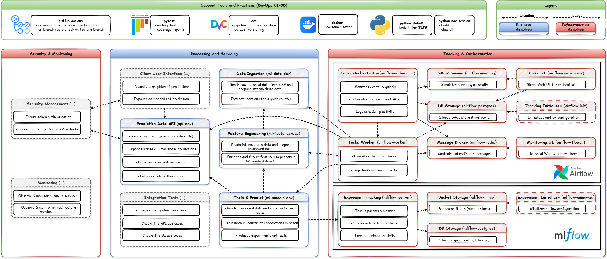
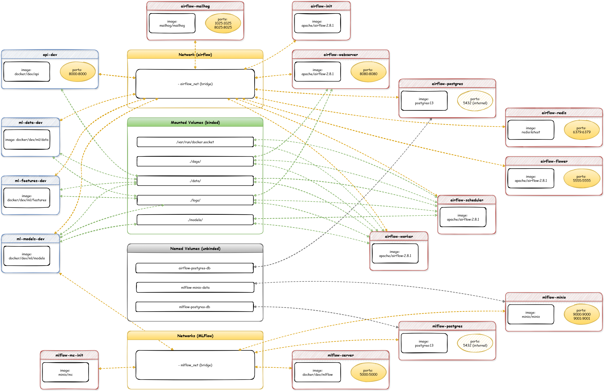
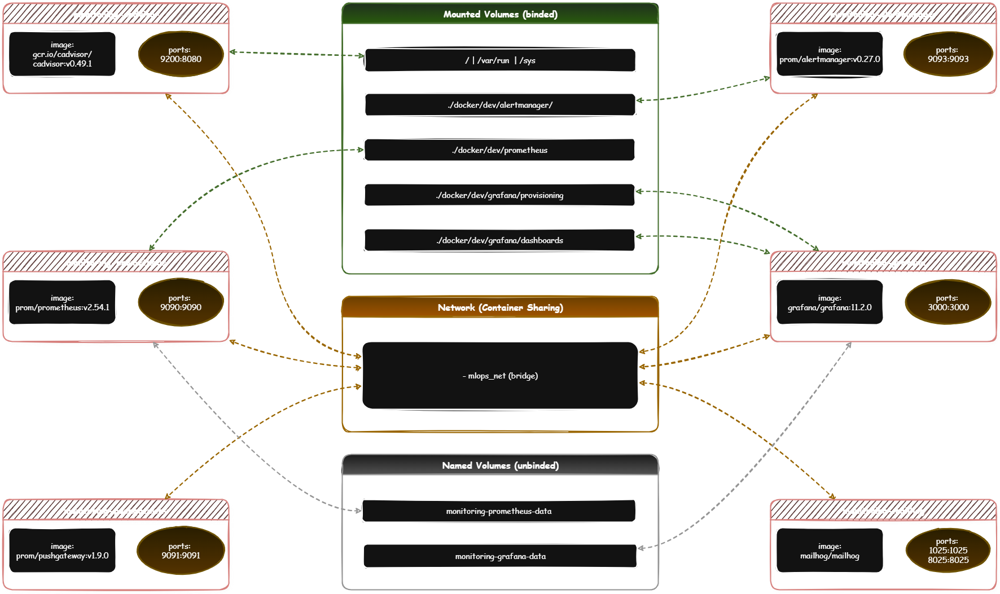
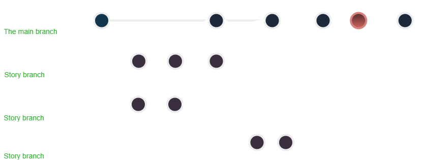

# 🚲 Cyclist Traffic MLOps Project

[](https://github.com/zheddhe/avr25-mle-trafic-cycliste/actions)
[](https://github.com/zheddhe/avr25-mle-trafic-cycliste/actions)

> A machine learning pipeline to provide bike traffic prediction in Paris.  
> Developed as part of the April 2025 Machine Learning Engineering (MLE) full training program.

## 🧭 Overview

This project implements a complete machine learning and MLOps architecture in three main stages:

### 1. 📐 Data Product Management

- Define business goals
- Scope the data lifecycle

### 2. 📊 Data Science

- Data collection and preprocessing
- Model development and evaluation
- Time series prediction

### 3. ⚙️ MLOps

- Reproducibility and continuous testing
- Containerization with microservices
- Security awareness
- Monitoring and orchestration
- Scalability

> The MLOps architecture we designed focuses on interactions between components
> to achieve our main business case: an external user can access daily refreshed
> bike traffic predictions.
>
> [](https://drive.google.com/file/d/1aglCRFaxXRVEEEwtE5ePFnW-vjE8CYa-/view?usp=sharing)

## 🧱 GitHub Structure

```text
avr25-mle-trafic-cycliste/
├── LICENSE             <- MIT license
├── README.md           <- This top-level README for developers using this project
├── pyproject.toml      <- Python project, dependency groups, pytest, coverage, and Ruff configuration
├── uv.lock             <- uv lockfile for the local development environment
├── data                <- Data shared with host (read/write)
│   ├── raw             <- Original, immutable data dumps (e.g., external sources)
│   ├── interim         <- Intermediate data derived from raw (goal-specific)
│   ├── processed       <- Processed data (e.g., feature-enriched)
│   └── final           <- Final stage data (e.g., train/test and predictions)
├── logs                <- Logs shared with host (read/write)
│   ├── ml              <- ML pipeline logs
│   ├── api             <- Data API logs
│   ├── scheduler       <- Airflow scheduler logs
│   └── dag[...]        <- Unit DAG run logs
├── models              <- Model artifacts shared with host (read/write)
│   └── ...
├── references          <- Data dictionaries, manuals, other explanatory material
│   └── ...
├── src/                <- All source code used in this project
│   ├── airflow/        <- Airflow orchestration management
│   │   ├── dags        <- Orchestrator DAGs code shared with host
│   │   │   ├── bike_traffic_pipeline_dag.py
│   │   │   └── bike_traffic_orchestrator_dag.py
│   │   │   ├── common
│   │   │   │   └── utils.py
│   │   ├── config      <- Orchestrator config shared with host (read-only)
│   │   │   └── bike_dag_config.json
│   ├── api/            <- FastAPI service (prediction readout)
│   │   └── main.py
│   └── ml/             <- Machine learning pipeline
│       ├── ingest      <- Scripts to ingest initial raw data or daily data
│       │   ├── data_utils.py
│       │   └── import_raw_data.py
│       ├── features    <- Scripts to turn raw data into modeling-ready data
│       │   ├── features_utils.py
│       │   └── build_features.py
│       └── models      <- Train models and compute batch predictions
│           ├── models_utils.py
│           └── train_and_predict.py
├── docker/             <- Container architecture
│   ├── dev/            <- Development setup
│   │   ├── grafana/    <- Config for Grafana dashboards and provisioning
│   │   │   ├── dashboards/
│   │   │   │   └── cadvisor_docker_insights.json
│   │   │   └── provisioning/
│   │   │       ├── dashboards.yaml
│   │   │       └── datasource.yaml
│   │   ├── prometheus/ <- Config for Prometheus targets and general configuration
│   │   │   └── prometheus.yml
│   │   ├── airflow/    <- Config and DAGs for Airflow
│   │   │   ├── dags/
│   │   │   │   ├── bike_traffic_orchestrator_dag.py
│   │   │   │   ├── bike_traffic_pipeline_dag.py
│   │   │   │   └── common
│   │   │   │       └── utils.py
│   │   │   ├── bike_dag_config.json
│   │   │   ├── connections.json
│   │   │   └── variables.json
│   │   ├── mlflow/     <- Custom Docker image for MLflow service
│   │   │   └── Dockerfile
│   │   ├── api/        <- Custom Docker image for API service
│   │   │   ├── requirements.txt
│   │   │   └── Dockerfile
│   │   └── ml/         <- Custom Docker images for ML pipeline services
│   │       ├── ingest/
│   │       │   ├── requirements.txt
│   │       │   └── Dockerfile
│   │       ├── features/
│   │       │   ├── requirements.txt
│   │       │   └── Dockerfile
│   │       └── models/
│   │           ├── requirements.txt
│   │           └── Dockerfile
│   └── prod/           <- Production setup
│       └── ...
└── tests/
    ├── unitary/        <- Unit tests (pytest for source code coverage)
    │   └── ...
    └── integration/    <- Integration tests
        └── ...
```

## ⚙️ Installation

### 🔧 Prerequisites

Initialize the development environment with Python, pipx, and uv, preferably from a
Linux virtual machine on your operating system.

#### Optional virtual machine creation on Windows

```powershell
# Check and activate the local virtual machine hypervisor.
Set-Service -Name WSLService -StartupType Automatic
Start-Service -Name WSLService
Get-Service WSLService

# Install an Ubuntu distribution.
wsl --install -d Ubuntu
```

#### Linux, through a virtual machine or directly

All commands in this README are provided from a Linux operating system point of view.

```bash
# Check and update your VM libraries, Python, pip, and pipx.
sudo apt update
sudo apt install --fix-missing
sudo apt install -y python3 python3-pip pipx
pipx ensurepath

# Install uv as the local project environment and dependency manager.
pipx install uv
```

### 🔧 Repository cloning and local environment setup

```bash
# Set up your local Git identity and clone the repository.
git config --global user.name "your user"
git config --global user.email "your_email@example.com"

# Configure your VM public key on GitHub by using an ed25519 key.
ssh-keygen -t ed25519 -C "your_email@example.com"
eval "$(ssh-agent -s)"
ssh-add ~/.ssh/id_ed25519

# Copy the content of your public key to GitHub > Settings > SSH and GPG keys.
cat ~/.ssh/id_ed25519.pub

# Check your connection.
ssh -T git@github.com

# Clone the repository.
git clone git@github.com:zheddhe/avr25-mle-trafic-cycliste.git
cd avr25-mle-trafic-cycliste
```

Create your local `.env` file from the tracked template before running Makefile
or Docker Compose commands:

```bash
cp .env.template .env
```

Then replace every `[replace_me]` value in `.env` with your local values. The
`.env` file is intentionally not tracked by Git because it may contain secrets.
Docker Compose reads `.env` automatically from the repository root. For shell
commands such as `make repo_setup`, load it explicitly when needed:

```bash
set -a
source .env
set +a
```

DVC setup can then be performed through the Makefile:

```bash
make repo_setup
```

## 🚀 DevOps setup

> This section covers the project setup as a monolithic architecture from a DevOps point of view.

This repository is not packaged as a Python distribution. The local Python environment
is managed by uv and is used for developer tooling, static analysis, tests, Pylance
import resolution, and local execution of the application code.

### uv dependency groups

| Group | Purpose |
|-------|---------|
| `app` | Local application surface: API, DAGs, ML scripts, MLflow, metrics, and orchestration imports. |
| `test` | Test and lint harness. Includes `app`. |
| `dev` | Full development harness. Includes `test` and DVC tooling. |

```bash
# Synchronize the complete local development environment from uv.lock.
uv sync --locked --group dev

# Run the current lint gate.
uv run --locked --group test ruff check .

# Run unit tests while excluding integration tests.
uv run --locked --group test pytest -m "not integration"

# Activate the uv-managed virtual environment in a command-line session.
source .venv/bin/activate

# Optional cleanup of local Python artifacts.
rm -rf .venv .pytest_cache .coverage htmlcov build dist *.egg-info
find . -type d -name "__pycache__" -prune -exec rm -rf {} +

# Execute the DVC pipeline.
uv run --locked --group dev dvc repro

# Launch the data API locally.
# The API will be available at http://localhost:10000/docs.
uv run --locked --group app uvicorn src.api.main:app --reload --port 10000
```

## MLOps setup

> This section covers the project setup as a containerized microservices architecture from an MLOps point of view as illustrated in the schemas below.
> [](https://drive.google.com/file/d/1-C0uL1whFDYXiqkDn20CK2AUF_-S3Ytp/view?usp=drive_link)
> [](https://drive.google.com/file/d/14DbcNiD3w7nrdkPiIymbMpX0-vzXRupW/view?usp=drive_link)
>
> Create and customize your own `.env` file from `.env.template` before starting
> the stack. The file contains Docker Compose variables, Makefile defaults,
> local credentials, and optional remote MLflow/DagsHub settings.

### 1. 🐳 Service containerization

We use **Docker** to simulate our production environment.

#### Docker on a virtual machine with Ubuntu distribution

> It is recommended to use a Docker engine directly on an Ubuntu virtual machine.

```bash
# Add official GPG key for Docker distribution.
sudo apt update
sudo apt install ca-certificates curl gnupg lsb-release -y

# Add official GPG key for Docker distribution.
sudo mkdir -m 0755 -p /etc/apt/keyrings
curl -fsSL https://download.docker.com/linux/ubuntu/gpg | \
  sudo gpg --dearmor -o /etc/apt/keyrings/docker.gpg

# Add official Docker repository.
echo \
  "deb [arch=$(dpkg --print-architecture) \
  signed-by=/etc/apt/keyrings/docker.gpg] \
  https://download.docker.com/linux/ubuntu \
  $(lsb_release -cs) stable" | \
  sudo tee /etc/apt/sources.list.d/docker.list > /dev/null

# Update packages list and install Docker components.
sudo apt update
sudo apt install docker-ce docker-ce-cli containerd.io docker-buildx-plugin docker-compose-plugin -y

# Add current user authorization to Docker group.
sudo usermod -aG docker $USER
newgrp docker
```

#### Optional local Docker Desktop with a virtual machine hypervisor

> As an alternative option, Docker Desktop can be used with additional support during the development phase.

Installation guide: [Windows](https://docs.docker.com/desktop/setup/install/windows-install/) / [Mac](https://docs.docker.com/desktop/setup/install/mac-install/) / [Linux](https://docs.docker.com/desktop/setup/install/linux/)

#### Operation commands

> All these unit actions are consolidated in the Makefile.

| Target | Description |
|--------|-------------|
| `sync` | Sync the local uv environment from `uv.lock`. |
| `lock-check` | Check that `uv.lock` is consistent with `pyproject.toml`. |
| `lint` | Run Ruff checks. |
| `test` | Run unit tests while excluding integration tests. |
| `ci` | Run local CI checks. |
| `compose-config` | Validate Docker Compose configuration. |
| `bootstrap` | Initialize bootstrap dependencies. |
| `repo_setup` | Configure Git identity and DVC S3 credentials. |
| `build` | Build Docker images for all profiles. |
| `rebuild_full` | Rebuild Docker images and fully restart platform services. |
| `start` | Start Docker services for the selected profile (`PROFILE=all/mlflow/airflow/monitoring/api/ptf`). |
| `stop` | Stop Docker services for the selected profile. |
| `logs` | Show Docker Compose logs for `SERVICE`. |
| `sim_api_loop` | Simulate 10 API stop/start cycles with a 5-second interval. |
| `sim_api_down` | Simulate a temporary API outage for 2 minutes. |
| `sim_api_req` | Simulate response status mix and request volume on `/predictions/{counter}`. |
| `clean` | Remove local Python caches and test artifacts only. |
| `clean_env` | Remove the uv-managed virtual environment. |
| `clean_full` | Remove Docker artifacts, including images, volumes, and networks. |
| `help` | Show Makefile help. |

```bash
# Validate the complete Docker Compose configuration.
make compose-config

# Build every Docker image.
make build

# Start all permanent platform services.
make start PROFILE=ptf

# Start only the API profile.
make start PROFILE=api

# Show API logs.
make logs SERVICE=api-dev

# Start a pipeline run in interactive mode.
docker compose --profile ml up ml-ingest-dev
docker compose --profile ml up ml-features-dev
docker compose --profile ml up ml-models-dev

# Stop everything, including networks, while keeping database volumes.
docker compose --profile all down

# Stop everything and remove all images, volumes, networks, and orphan items.
make clean_full
```

### 2. 📈 Experience tracker

We use **MLflow** to record **metrics**, **params**, and training/prediction
**artifacts** (scikit-learn pipeline, autoregressive transformer, train/test
splits, predictions, metrics, and hyperparameters).

The MLflow-related environment variables are centralized in `.env.template` and
should be customized in your local `.env` file.

#### Local MLflow service

The default `.env.template` values target the local Docker Compose MLflow and
MinIO services from inside the Compose network:

```bash
MLFLOW_TRACKING_URI="http://mlflow-server:5000"
MLFLOW_S3_ENDPOINT_URL="http://mlflow-minio:9000"
AWS_ACCESS_KEY_ID="minio"
AWS_SECRET_ACCESS_KEY="[replace_me]"
```

For host-side commands outside Docker Compose, use the exposed local endpoints in
your shell or local `.env` when needed:

```bash
MLFLOW_TRACKING_URI="http://127.0.0.1:5001"
MLFLOW_S3_ENDPOINT_URL="http://127.0.0.1:9000"
AWS_ACCESS_KEY_ID="minio"
AWS_SECRET_ACCESS_KEY="[replace_me]"
```

#### DagsHub remote MLflow service

To use the DagsHub remote service instead of the local MLflow container, override
these values in your local `.env` or shell session:

```bash
MLFLOW_TRACKING_URI="https://dagshub.com/zheddhe/avr25-mle-trafic-cycliste.mlflow"
MLFLOW_TRACKING_USERNAME="[replace_me]"
MLFLOW_TRACKING_PASSWORD="[replace_me]"
```

### 3. 🧩 Multi-counter orchestration

- The environment configuration is mounted read-only in the Airflow Init container into `/opt/airflow/config/` (repo source: `./docker/dev/airflow/`). It configures especially:
  - The host repository root, to adjust to your production or development environment.
  - The MLflow server information. By default, this uses the platform technical stack, but it can point to a cloud-hosted service.
  - The images to use for the various containers.
  - The API connection as an admin to refresh predictions.

- The business configuration is mounted read-only in the Airflow containers (Scheduler / WebServer / Worker) into
  `/opt/airflow/config/bike_dag_config.json` (repo source: `./src/airflow/config/`). It configures especially:
  - The list of managed counters extracted from the original dataset.
  - The anchor date used to simulate production startup.
  - The daily increment, which defines which portion of the original dataset is considered to shift the data by one production day.

- `bike_traffic_init`: one-shot historical bootstrap per counter.
  - It short-circuits if the Airflow Variable `bike_init_done__<counter>` equals `"1"`.
  - On success, it sets that variable to `"1"`.

- `bike_traffic_daily`: rolling increment assuming init has been done.
  - Triggered by the parent only. Its `schedule` is `None`.

- `bike_traffic_orchestrator`:
  - Every day, for each configured counter, trigger `init` then `daily`.
  - The `init` run is cheap if already done because it is short-circuited.

### 4. 🧩 Monitoring and alerting

The project has defined:

- Grafana dashboards relying on Prometheus collected metrics to:
  - Monitor the system itself: active containers, restarts, memory usage, and CPU usage.
  - Monitor business metrics for the ML pipeline.
- Alerts that can trigger email notifications when detecting:
  - API service down for a configurable period of time.
  - API service instability, such as restart loops.

The Pushgateway behavior is controlled by the `DISABLE_METRICS_PUSH` variable in
`.env`:

```bash
# Inhibit push metrics to Pushgateway: 1 = disabled, other values = enabled.
DISABLE_METRICS_PUSH=1
```

## 🤝 Team collaboration

### 1. 📖 External Documentation

- [Data exploration report](https://docs.google.com/spreadsheets/d/1tlDfN-8h9XTJAoKY0zAzmgrJqX90ZAeer48mFxZ_IQg/edit?usp=drive_link)
- [Data processing and modeling report](https://docs.google.com/document/d/1vpRAWaIRX5tjIalEjGLTIjNqwEh1z1kXRZjJA9cgeWo/edit?usp=drive_link)

### 2. 🗺️ GitHub Dashboards

- [Roadmap](https://github.com/users/zheddhe/projects/6/views/2)
- [Current Iteration](https://github.com/users/zheddhe/projects/6/views/3)

### 3. 🔀 Branch Workflow

Based on [jbenet/simple-git-branching-model.md](https://gist.github.com/jbenet/ee6c9ac48068889b0912) and illustrated below:

- Create one branch per story/bugfix and merge via pull requests.
- Tag stable versions ideally after each successful story/bugfix merge.

[](https://drive.google.com/file/d/1ctszHKpKDMjhGkC_sdQ3RD8RGAonb967/view?usp=drive_link)

### 4. 🧪 Testing and Continuous Integration

Tests are executed using `pytest`, including:

- ✅ Unit tests for each service separately (`tests/unitary/`)  
- ✅ Cross-service integration tests (`tests/integration/`)

Continuous Integration workflows are handled with GitHub Actions:

- `ci_main.yml`: runs on every push or pull request to the `main` branch  
- `ci_branch.yml`: runs on every push to any other branch

The CI environment uses uv dependency groups directly and runs Ruff before pytest.

### 5. 👥 Contributors

- Rémy Canal – [@remy.canal](mailto:remy.canal@live.fr)  
- Elias Djouadi – [@elias.djouadi](mailto:elias.djouadi@gmail.com)
- Koladé Houessou – [@kolade.houessou](mailto:koladehouessou@gmail.com)
- Sofia Bouizzoul - [@sofia.bouizzoul](mailto:sofiabouizzoul98@gmail.com)
