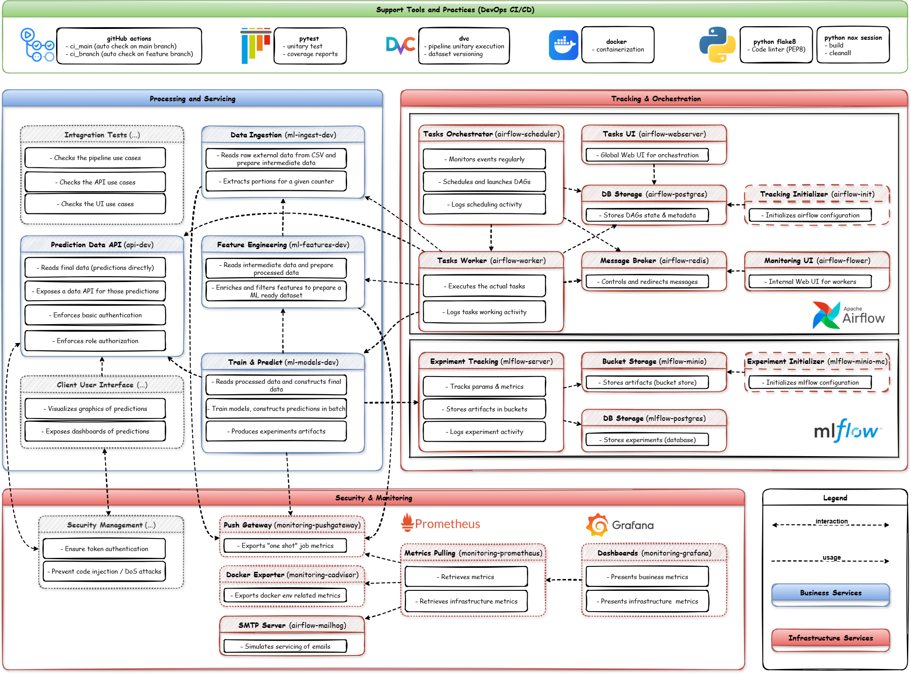

# 🚲 Cyclist Traffic MLOPS Project

[](https://github.com/zheddhe/avr25-mle-trafic-cycliste/actions)
[](https://github.com/zheddhe/avr25-mle-trafic-cycliste/actions)

> A machine learning pipeline to provide bike traffic prediction in Paris.  
> Developed as part of the April 2025 Machine Learning Engineering (MLE) full training program.

## 🧭 Overview

This project implements a complete machine learning and MLOps architecture in three main stages:

### 1. 📐 Data Product Management

- Define business goals
- Scope the data lifecycle

### 2. 📊 Data Science

- Data collection and preprocessing
- Model development and evaluation
- Time series prediction

### 3. ⚙️ MLOps

- Reproducibility and continuous testing
- Containerization with microservices
- Security awareness
- Monitoring and orchestration
- Scalability

> The MLOps architecture we designed focuses on interactions between components
> to achieve our main business case: an external user can access daily refreshed
> bike traffic predictions.

[](https://drive.google.com/file/d/1aglCRFaxXRVEEEwtE5ePFnW-vjE8CYa-/view?usp=sharing)

## 🧱 GitHub Structure

```text
avr25-mle-trafic-cycliste/
├── LICENSE             <- MIT license
├── README.md           <- This top-level README for developers using this project
├── flake8              <- Linter configuration rules
├── pyproject.toml      <- Python development project configuration
├── uv.lock             <- UV lockfile for the dev environment
├── noxfile.py          <- Nox dev sessions (build/clean)
├── data                <- Data shared with host (read/write)
│   ├── raw             <- Original, immutable data dumps (e.g., external sources)
│   ├── interim         <- Intermediate data derived from raw (goal-specific)
│   ├── processed       <- Processed data (e.g., feature-enriched)
│   └── final           <- Final stage data (e.g., train/test and predictions)
├── logs                <- Logs shared with host (read/write)
│   ├── ml              <- ML pipeline logs
│   ├── api             <- data API logs
│   ├── scheduler       <- airflow scheduler logs
│   └── dag[...]        <- unitary dag run logs
├── models              <- Models artefacts shared with host (read/write)
│   └── ...
├── references          <- Data dictionaries, manuals, other explanatory material
│   └── ...
├── src/                <- All source code used in this project
│   ├── airflow/        <- Airflow orchestration management
│   │   ├── dags        <- Orchestrator DAGs code shared with host
│   │   │   ├── bike_traffic_pipeline_dag.py
│   │   │   └── bike_traffic_orchestrator_dag.py
│   │   │   ├── common
│   │   │   │   └── utils.py
│   │   ├── config      <- Orchestrator config shared with host (read-only)
│   │   │   └── bike_dag_config.json
│   ├── api/            <- FastAPI service (prediction readout)
│   │   └── main.py
│   └── ml/             <- Machine learning pipeline
│       ├── ingest      <- Scripts to ingest initial raw data or daily data
│       │   ├── data_utils.py
│       │   └── import_raw_data.py
│       ├── features    <- Scripts to turn raw data into modeling-ready data
│       │   ├── features_utils.py
│       │   └── build_features.py
│       └── models      <- Train models and compute batch predictions
│           ├── models_utils.py
│           └── train_and_predict.py
├── docker/             <- Container architecture
│   ├── dev/            <- Development setup
│   │   ├── grafana/    <- Config for grafana (dashboard & provisionning)
│   │   │   ├── dashboards/
│   │   │   │   └── cadvisor_docker_insights.json
│   │   │   └── provisioning/
│   │   │       ├── dashboards.yaml
│   │   │       └── datasource.yaml
│   │   ├── prometheus/ <- Config for prometheus targets and general configuration
│   │   │   └── prometheus.yml
│   │   ├── airflow/    <- Config (business & technical) and DAGs for airflow
│   │   │   ├── dags/
│   │   │   │   ├── bike_traffic_orchestrator_dag.py
│   │   │   │   ├── bike_traffic_pipeline_dag.py
│   │   │   │   └── common
│   │   │   │       └── utils.py
│   │   │   ├── bike_dag_config.json
│   │   │   ├── connections.json
│   │   │   └── variables.json
│   │   ├── mlflow/     <- Custom docker image for mlflow service
│   │   │   └── Dockerfile
│   │   ├── api/        <- Custom docker image for api service
│   │   │   ├── requirements.txt
│   │   │   └── Dockerfile
│   │   └── ml/         <- Custom docker images for ml pipeline services
│   │       ├── ingest/
│   │       │   ├── requirements.txt
│   │       │   └── Dockerfile
│   │       ├── features/
│   │       │   ├── requirements.txt
│   │       │   └── Dockerfile
│   │       └── models/
│   │           ├── requirements.txt
│   │           └── Dockerfile
│   └── prod/           <- Production setup
│       └── ...
└── tests/              
    ├── unitary/        <- Unit tests (pytest for source code coverage)
    │   └── ...
    └── integration/    <- integration tests (pytest for integration test)
        └── ...
```

## ⚙️ Installation

### 🔧 Prerequisites

Initialize the build environment with Python, pipx, Nox, and UV preferrably from a
virtual Machine on your OS (with Ubuntu 22.04 ior latest distribution)

#### (optional) Virtual machine creation on Windows

```bash
### Check and activate the local virtual machine Hypervisor 
Set-Service -Name WSLService -StartupType Automatic
Start-Service -Name WSLService
Get-Service WSLService

# install an Ubuntu distribution
wsl --install -d Ubuntu
```

#### Linux (through virtual machine or directly)

All the commands in this readme will are provided from a "Linux" OS point of view

```bash
# Check and update your VM libraries/python/pip/pipx and ensure pipx path
sudo apt update
sudo apt install --fix-missing
sudo apt install -y python3 python3-pip pipx
pipx ensurepath

# Install Nox (multi-OS session runner) and UV (fast virtual env + resolver)
pipx install nox uv
```

### 🔧 Repository cloning and DVC setup (One-time init)

Please refer to DagsHub remote setup actions. Example steps:

- Git setup and cloning

```bash
# Setup your local git and clone the repository
git config --global user.name "your user"
git config --global user.email "your_email@example.com" 
# Configure your VM public key on GitHub (using ed25519 key type)
ssh-keygen -t ed25519 -C "your_email@example.com"
eval "$(ssh-agent -s)"
ssh-add ~/.ssh/id_ed25519
# Copy the content of your public key on GitHub > Settings > SSH and PGP keys > new key
cat ~/.ssh/id_ed25519.pub
# Check your connection
ssh -T git@github.com

# Finally clone the repository
git clone git@github.com:zheddhe/avr25-mle-trafic-cycliste.git
```

- DVC setup

```bash
# Setup your personal credentials for DagsHub
dvc remote modify origin --local access_key_id [...]
dvc remote modify origin --local secret_access_key [...]
```

## 🚀 DevOps setup

> This section covers the project setup as a monolithic architecture from a DevOps point of view.

```bash
### Rebuild a complete virtual dev env (runs flake8 and pytest)
nox -s build

### Activate the virtual environment in a command-line session
source .nox/build/bin/activate

### [Optional] Clean all generated files and all virtual envs (build included)
nox -s cleanall

### Execute the DVC pipeline
dvc repro

### Launch the data API (use any free port)
# The API will be available at http://localhost:10000/docs
uvicorn src.api.main:app --reload --port 10000
```

## MLOps setup

> This section covers the project setup as a containerized microservices architecture from an MLOps point of view.
>
> - Custom your **.env** file to populate environment variables needed at startup (an .env.template is provided)
> - Use **--build** extra option in the following commands to rebuild docker images prior to an execution
>
> [](https://drive.google.com/file/d/1-C0uL1whFDYXiqkDn20CK2AUF_-S3Ytp/view?usp=drive_link)

```bash
### NB : toutes les commandes ont implicitement les arguments
# -p avr25-mle-trafic-cycliste -f docker-compose.yaml --env-file .env

# 1) Init and build the docker images
docker compose --profile all build

# 2) Start all the backends services : 
# profile mlflow : server / postgres / minio / mc-init in background
docker compose --profile mlflow up -d
# profile airflow : webserver / worker / scheduler / init / postgres / redis / mailhog in background
docker compose --profile airflow up -d
# profile monitoring : grafana / prometheus / cadvisor / node-exporter
docker compose --profile monitoring up -d

# 3) Start all the permanent business services (ie. the API) in background
# profile api : data api service
docker compose --profile api up -d

# 4) Start a pipeline run in interactive mode (they must be orchestrated in sequence)
# profile ml : raw ingestion / features engineering / train and predict services
docker compose --profile ml up ml-ingest-dev
docker compose --profile ml up ml-features-dev
docker compose --profile ml up ml-models-dev

# /!\ Stop everything (including networks but keep database volumes)
docker compose --profile all down

# /!\ Stop everything and remove all images/volumes/networks (full reset) and clean all orphan items
docker compose --profile all down -v --rmi all && docker system prune -f

# Docs: http://localhost:8000/docs (Basic Auth required)
```

### 1. 🐳 Container manager

We use **Docker Desktop** to simulate local development and production.

#### Local Docker Desktop with a virtual machine hypervisor

Installation guide: [Windows](https://docs.docker.com/desktop/setup/install/windows-install/) / [Mac](https://docs.docker.com/desktop/setup/install/mac-install/) / [Linux](https://docs.docker.com/desktop/setup/install/linux/)

#### Virtual machine with Ubuntu distribution

It is recommended however to install your dev env on a Virtual Machine using Ubuntu latest distribution

```bash
### [On Ubuntu Virtual Machine] 
# Add official GPG key for docker distribution
sudo apt update
sudo apt install ca-certificates curl gnupg lsb-release -y

# Add official GPG key for docker distribution
sudo mkdir -m 0755 -p /etc/apt/keyrings
curl -fsSL https://download.docker.com/linux/ubuntu/gpg | \
  sudo gpg --dearmor -o /etc/apt/keyrings/docker.gpg

# Add official docker repository
echo \
  "deb [arch=$(dpkg --print-architecture) \
  signed-by=/etc/apt/keyrings/docker.gpg] \
  https://download.docker.com/linux/ubuntu \
  $(lsb_release -cs) stable" | \
  sudo tee /etc/apt/sources.list.d/docker.list > /dev/null

# Update packages list and install Docker components
sudo apt update
sudo apt install docker-ce docker-ce-cli containerd.io docker-buildx-plugin docker-compose-plugin -y

# Add current user authorization to docker group
sudo usermod -aG docker $USER
newgrp docker
```

### 2. 📈 Experience tracker

We use **MLflow** to record **metrics**, **params**, and training/prediction
**artifacts** (scikit-learn pipeline, autoregressive transformer, train/test
splits, predictions, metrics, and hyperparameters).

### 3. 🧩 Multi-counter orchestration

- The environment configuration is mounted read-only in the Airflow Init container into `/opt/airflow/config/` (repo source: `./docker/dev/airflow/`), it configures especially :
  - The host repository root (to adjust to your production or dev environment)
  - The mlflow server information (by default the one of the technical stack propose, could be a cloud hosted one)
  - The images to use for the various container
  - the API connection as an admin (to refresh the prediction)

- The business configuration is mounted read-only in the Airflow containers (Scheduler / WebServer / Worker) into
  `/opt/airflow/config/bike_dag_config.json` (repo source: `./src/airflow/config/`), it configures especially :
  - The list counters managed (extracted from the original dataset)
  - The anchor date (when do we start from to simulate our production)
  - The daily increment (which portion of the original dataset is considered to shift the data of 1 production day)

- `bike_traffic_init`: one-shot historical bootstrap per counter.
  - It short-circuits if the Airflow Variable `bike_init_done__<counter>`
    equals `"1"`.
  - On success, it sets that variable to `"1"`.

- `bike_traffic_daily`: rolling increment assuming init has been done.
  - Triggered by the parent only (its `schedule` is `None`).

- `bike_traffic_orchestrator`:
  - Every day: for each configured counter, trigger `init` then `daily`.
  - The `init` run is cheap if already done (short-circuited).

#### DagsHub remote service

```bash
### Configure environment variables
export MLFLOW_TRACKING_URI=https://dagshub.com/zheddhe/avr25-mle-trafic-cycliste.mlflow
export MLFLOW_TRACKING_USERNAME=<DagsHub ACCOUNT>
export MLFLOW_TRACKING_PASSWORD=<DagsHub TOKEN (preferably over a personal password)>
```

#### Local service

```bash
### Configure environment variables
export MLFLOW_TRACKING_URI=http://127.0.0.1:5000
export MLFLOW_S3_ENDPOINT_URL=http://127.0.0.1:9000
export AWS_ACCESS_KEY_ID=minio
export AWS_SECRET_ACCESS_KEY=minio123
```

## 🤝 Team collaboration

### 1. 📖 External Documentation

- [Data exploration report](https://docs.google.com/spreadsheets/d/1tlDfN-8h9XTJAoKY0zAzmgrJqX90ZAeer48mFxZ_IQg/edit?usp=drive_link)
- [Data processing and modeling report](https://docs.google.com/document/d/1vpRAWaIRX5tjIalEjGLTIjNqwEh1z1kXRZjJA9cgeWo/edit?usp=drive_link)

### 2. 🗺️ GitHub Dashboards

- [Roadmap](https://github.com/users/zheddhe/projects/6/views/2)
- [Current Iteration](https://github.com/users/zheddhe/projects/6/views/3)

### 3. 🔀 Branch Workflow

Based on [jbenet/simple-git-branching-model.md](https://gist.github.com/jbenet/ee6c9ac48068889b0912) and illustrated below:

- Create one branch per story/bugfix and merge via pull requests
- Tag stable versions ideally after each successful story/bugfix merge

[](https://drive.google.com/file/d/1ctszHKpKDMjhGkC_sdQ3RD8RGAonb967/view?usp=drive_link)

### 4. 🧪 Testing and Continuous Integration

Tests are executed using `pytest`, including:

- ✅ Unit tests for each service separately (`tests/unitary/`)  
- ✅ Cross-service integration tests (`tests/integration/`)

Continuous Integration workflows are handled with GitHub Actions:

- `ci_main.yml`: runs on every push or pull request to the `main` branch  
- `ci_branch.yml`: runs on every push to any other branch

### 5. 👥 Contributors

- Rémy Canal – [@remy.canal](mailto:remy.canal@live.fr)  
- Elias Djouadi – [@elias.djouadi](mailto:elias.djouadi@gmail.com)
- Koladé Houessou – [@kolade.houessou](mailto:koladehouessou@gmail.com)
