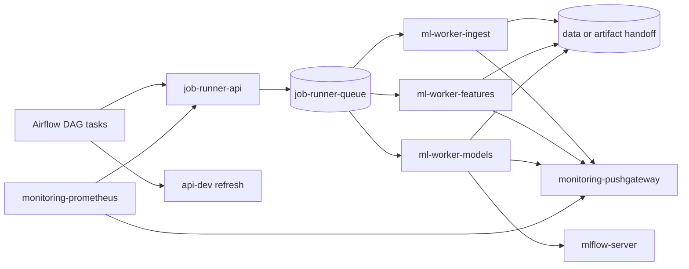

# Airflow job runner strategy

This document is the Phase 7 design artifact for issue #56. It defines a
safer local production-like model for Airflow-triggered ML jobs without
implementing the worker pool yet.

The current `docker/dev` runtime is intentionally unchanged by this story.
The target described here should feed a future `docker/prod` or
`docker/local-prod` implementation.

## Scope and inputs

The design uses these project inputs:

| Source | Use in this design |
| ------ | ------------------ |
| `docker-compose.yaml` | Current Airflow, ML, MLflow, API, monitoring, network, user, and mount model. |
| `docs/runtime-communication-matrix.md` | Current Docker socket execution path, service-name traffic, shared mounts, and local-only boundaries. |
| `docs/runtime-security-boundaries.md` | Runtime identities, Docker socket risk, non-root targets, and job execution boundary. |
| `docs/local-prod-network-topology.md` | Target functional networks and the `pipeline_runtime_net` boundary. |
| `docs/repository-structure.md` | DAG placement rules and the current `docker/dev` versus future `docker/prod` split. |
| `docker/dev/airflow/config/variables.json` | Current Docker image names, Docker network, MLflow, MinIO, Pushgateway, UID, and GID variables. |
| `docker/dev/airflow/config/connections.json` | Current Airflow HTTP connection to `api-dev`. |
| `docker/dev/airflow/scripts/airflow-init.sh` | Current Airflow variable, connection, and pool bootstrap flow. |
| `docker/dev/airflow/scripts/airflow-entrypoint.sh` | Current root entrypoint used to adjust Docker socket group access. |
| `docker/dev/airflow/config/bike_dag_config.json` | Multi-counter init and daily DAG business configuration. |

This story is design-only. It does not implement the runner, rewrite DAGs,
remove the Docker socket from `docker/dev`, add Kubernetes, or introduce
production secrets.

## Decision summary

The preferred local production-like target is a controlled internal job
runner composed of:

1. a small internal job API;
2. a dedicated queue and job state store;
3. pre-started non-root ML worker containers;
4. an allow-list of supported job commands;
5. explicit artifact handoff and observability contracts.

Airflow should submit and observe jobs. It should not create containers
through the host Docker socket in the production-like runtime.

This target combines the best properties of a queue-based runner and a
pre-started worker pool while keeping the architecture translatable to
Kubernetes Jobs or CronJobs later.

## Current Airflow-triggered execution model

The current local development model uses Airflow as both orchestrator and
container launcher:

1. Airflow imports variables and connections during `airflow-init`.
2. DAG tasks read Docker image names, network names, MLflow endpoints,
   MinIO credentials, Pushgateway address, and UID/GID values from Airflow
   variables.
3. The Airflow worker mounts `/var/run/docker.sock`.
4. The Airflow worker starts ML containers for ingestion, feature engineering,
   training, and prediction.
5. ML containers read and write shared `data`, `logs`, and `models` paths.
6. Model jobs log run evidence to MLflow and push batch metrics to
   Pushgateway.
7. Airflow calls the FastAPI admin refresh endpoint after successful runs.

This model is practical for local development because it reuses existing
Docker images and keeps artifacts visible on the host. It is not a
production-like job boundary.

## Why broad container-runtime access is not production-like

A container with write access to the Docker socket can ask the host Docker
daemon to create containers, mount host paths, join networks, and access
data or secrets available to the daemon.

The current `airflow-worker` therefore mixes two responsibilities:

- orchestration: schedule tasks, track dependencies, expose retries, and keep
  DAG state;
- execution control: create runtime containers with host-level Docker
  privileges.

This coupling creates production-like concerns:

| Concern | Current behavior | Target behavior |
| ------- | ---------------- | --------------- |
| Privilege boundary | Airflow worker can control the host container runtime. | Airflow can call only a narrow job submission interface. |
| Runtime user | Worker uses a root entrypoint to align Docker socket access. | Airflow and ML workers run without Docker socket access. |
| Network scope | Jobs inherit networks selected by Airflow variables. | Jobs run on predefined functional networks. |
| Command scope | DAG code can construct container commands. | Runner accepts only allow-listed job types and arguments. |
| Artifact scope | Jobs write broad host-mounted folders. | Jobs publish through an explicit handoff contract. |
| Observability | DockerOperator status is mixed with container logs. | Runner exposes job state, retries, logs, and metrics. |

## Workload model

The runner must cover the existing ML pipeline shape:

| Job type | Current image or action | Main outputs | External dependencies |
| -------- | ----------------------- | ------------ | --------------------- |
| `ingest` | `ml-ingest-dev` | interim data and ingest metrics | raw data, `data`, `logs`, Pushgateway |
| `features` | `ml-features-dev` | processed features and feature metrics | interim data, `data`, `logs`, Pushgateway |
| `models` | `ml-models-dev` | forecasts, model artifacts, MLflow runs | processed data, `data`, `models`, `logs`, MLflow, Pushgateway |
| `api_refresh` | `api-dev` HTTP admin call | refreshed serving cache | FastAPI service and API credentials |

The init and daily DAGs should keep their business responsibility: choose
counters, derive ranges or dates, trigger jobs in the right order, and decide
whether downstream refresh is allowed. They should stop owning container
runtime details.

## Alternatives considered

| Alternative | Benefits | Limitations | Decision |
| ----------- | -------- | ----------- | -------- |
| Pre-started non-root worker pool | Removes Docker socket from Airflow, keeps local Compose simple, makes users and mounts explicit. | Needs a command dispatch contract and status tracking; long-running workers must be supervised. | Use as part of the selected target. |
| Queue-based job runner | Decouples Airflow task lifetime from job execution, supports backpressure and retries, maps well to multiple counters. | Requires queue state, idempotency, and a polling or callback contract. | Use as part of the selected target. |
| Controlled internal API or command runner | Gives Airflow one narrow interface, allows request validation, and hides execution internals. | API must not become a remote shell; commands and paths need strict allow-lists. | Use as the Airflow-facing entrypoint. |
| Compose profile with long-lived workers | Fits local production-like Compose and avoids Kubernetes as a hard dependency. | Scaling is coarse and depends on Compose replicas or explicit services. | Use initially for `docker/prod` or `docker/local-prod`. |
| Restricted container-runtime proxy | Smaller transition from DockerOperator and could enforce image or mount restrictions. | Still exposes container-runtime semantics and remains weaker than a true job boundary. | Keep only as a temporary fallback, not the target. |
| Kubernetes Jobs or CronJobs | Stronger future fit for isolated batch jobs, service accounts, pod security, and retry policies. | Out of scope now and too large for the local Compose target. | Treat as future migration target. |

## Selected target architecture



The diagram is a target design, not a `docker/dev` implementation diff.

### Control plane

Airflow submits a typed job request to `job-runner-api`. The request includes:

- `dag_id`;
- `task_id`;
- `run_id`;
- `try_number`;
- `counter_id`;
- `job_type`;
- validated business parameters;
- expected input and output artifact references.

The API validates the request, assigns a `job_id`, writes a job record, and
enqueues the job. Airflow receives `job_id` and observes the job until it
reaches a terminal state.

### Worker pool

Workers are long-lived containers started by Compose. They consume jobs from
the queue and execute only allow-listed commands.

Initial worker options:

| Worker shape | Description | Use case |
| ------------ | ----------- | -------- |
| Typed workers | Separate `ml-worker-ingest`, `ml-worker-features`, and `ml-worker-models` services. | Clear permissions, images, and resource sizing per stage. |
| Generic ML worker | One worker image containing the three Python entrypoints. | Simpler first implementation and easier local validation. |
| Model-family workers | Dedicated workers for future voting or model-family parallelism. | Later scaling when several model families train in parallel. |

The recommended first implementation is a generic ML worker image with typed
queue routing or command allow-listing. It can later be split into typed
workers if resource or permission differences justify it.

### Job state model

The runner should expose a small state machine:

| State | Meaning | Airflow behavior |
| ----- | ------- | ---------------- |
| `submitted` | Request was accepted and persisted. | Continue polling. |
| `queued` | Job is waiting for a worker. | Continue polling or sensor deferral. |
| `running` | Worker started the command. | Continue polling and link logs. |
| `succeeded` | Command exited successfully and outputs were published. | Mark task successful. |
| `failed` | Command failed with a controlled error. | Fail the Airflow attempt. |
| `canceled` | Job was canceled by operator or cleanup policy. | Fail or skip according to DAG policy. |
| `expired` | Job exceeded retention or timeout. | Fail with an explicit timeout reason. |

Airflow retries should create distinct external attempts by including
`try_number` in the idempotency key. Re-submitting the same key should return
the existing `job_id` instead of duplicating work.

## Impact on Airflow DAGs

The future DAG change should replace direct container creation with a narrow
job client.

Current DAG responsibility:

- build container commands;
- select Docker images and networks;
- pass MLflow, MinIO, Pushgateway, UID, and GID variables;
- wait for the container exit code;
- call API refresh after successful jobs.

Target DAG responsibility:

- build typed business job specs;
- submit jobs to `job-runner-api`;
- wait for runner terminal state;
- map runner failure to Airflow failure;
- call API refresh through the existing HTTP connection;
- preserve DAG-level retry, schedule, and dependency semantics.

DAG code should stay near Airflow runtime assets under `docker/dev` or the
future `docker/prod` Airflow area unless the project later decides to package
DAGs as importable application modules. Reusable client or schema logic may
live under `src/` with tests, but deployment-specific DAG wiring should remain
close to the Airflow runtime that consumes it.

## Init and daily DAG trigger flow

### Initial load DAG

1. Read `bike_dag_config.json`.
2. For each configured counter, submit `ingest`.
3. Submit `features` only after the matching ingest job succeeds.
4. Submit `models` only after the matching feature job succeeds.
5. Call the API refresh endpoint only when required model or forecast outputs
   are promoted.
6. Fail the Airflow run if any required runner job fails.

### Daily DAG

1. Compute the daily range or business window.
2. Submit `ingest` with the daily range and counter configuration.
3. Submit `features` and `models` with the same idempotency context.
4. Promote or refresh final prediction data only after successful model jobs.
5. Keep Airflow retries at the orchestration layer while the runner records
   every external job attempt.

In both flows, Airflow never asks Docker to start a container. It only asks the
job runner to execute an allowed job type.

## Container image impact

The future implementation should introduce at least one runner image:

| Image | Responsibility | Notes |
| ----- | -------------- | ----- |
| `job-runner-api` | Validate job requests, expose job status, and enqueue work. | Small FastAPI service; internal-only; no Docker socket. |
| `ml-worker` | Execute allow-listed ML entrypoints as a non-root user. | Can initially reuse dependencies from current ML images. |
| `ml-worker-ingest` | Optional typed worker for ingestion. | Split only if permissions or scaling require it. |
| `ml-worker-features` | Optional typed worker for feature engineering. | Split only if permissions or scaling require it. |
| `ml-worker-models` | Optional typed worker for training and prediction. | Likely first candidate for separate resources. |

Existing `ml-ingest-dev`, `ml-features-dev`, and `ml-models-dev` images should
remain valid for `docker/dev` while the local production-like runtime is built
separately.

## Network impact

The target aligns with `docs/local-prod-network-topology.md`.

| Component | Target networks | Reason |
| --------- | --------------- | ------ |
| Airflow worker or DAG execution service | `orchestration_net`, `pipeline_runtime_net` | Keep Airflow metadata access separate from job submission. |
| `job-runner-api` | `pipeline_runtime_net`, `observability_net` | Receive Airflow job submissions and expose runner metrics. |
| Job queue or state store | `pipeline_runtime_net` | Internal runner state only. |
| ML workers | `pipeline_runtime_net`, `tracking_client_net` | Read job specs, publish outputs, push metrics, and log MLflow runs. |
| `mlflow-server` | `tracking_client_net`, `tracking_backend_net` | Accept MLflow client calls without exposing backends broadly. |
| `monitoring-pushgateway` | `pipeline_runtime_net`, `observability_net` | Receive batch metrics and expose scrape endpoint. |
| `api-dev` | `pipeline_runtime_net`, `observability_net` | Receive refresh call and expose application metrics. |

The runner should not join Airflow metadata networks unless it truly needs
Airflow internals. The queue should not be the same Redis instance used by
Airflow Celery unless a future design explicitly accepts that coupling.

## User and permission impact

Target permissions:

- no Docker socket mount in Airflow or runner containers;
- no root entrypoint for worker execution;
- ML workers run as a non-root application user;
- job API can enqueue and read job state but cannot execute arbitrary shell;
- command arguments are validated against typed schemas and allow-lists;
- writable paths are limited to approved data, log, model, or artifact
  handoff locations;
- credentials are scoped to the job type that needs them.

The current `airflow-worker` root entrypoint is a local-development exception.
The production-like runtime should remove this exception once the runner takes
over ML execution.

## Volume and artifact handoff impact

Phase 1 can keep local bind mounts to reduce migration risk:

| Path | Phase 1 behavior | Target concern |
| ---- | ---------------- | -------------- |
| `data/raw` | Read by ingest workers. | Read-only for workers except controlled import paths. |
| `data/interim` | Written by ingest and read by feature jobs. | Explicit job output reference. |
| `data/processed` | Written by feature jobs and read by model jobs. | Explicit job output reference. |
| `data/final` | Written or promoted by model jobs and read by API. | Controlled release contract. |
| `models` | Written by model jobs. | Prefer MLflow artifacts or model registry evidence. |
| `logs` | Written by runner and workers. | Later move to remote or structured log storage. |

Phase 2 should replace broad shared mounts with an explicit artifact handoff
contract, such as object storage, release manifests, or a small promotion
service. The runner should make artifact paths explicit in the job record so
Airflow and operators can audit what each job produced.

## Observability impact

The runner should expose its own operational metrics and preserve existing ML
job metrics.

| Signal | Source | Target sink |
| ------ | ------ | ----------- |
| Job state | `job-runner-api` or state store | Airflow polling and runner API. |
| Job duration | Runner and ML jobs | Prometheus through runner metrics or Pushgateway. |
| Job records processed | ML job entrypoints | Existing Pushgateway flow. |
| Model metrics and artifacts | Model worker | MLflow server. |
| Logs | Runner and workers | Airflow task links initially; structured logs later. |
| Queue depth | Queue or runner API | Prometheus scrape. |
| Worker liveness | Worker heartbeat | Prometheus scrape or runner health endpoint. |

Airflow should display the runner `job_id`, terminal state, and a log or
status URL in task logs. A failed runner job should include the command type,
counter ID, exit code, error category, and artifact references that were
created before failure.

## Retry and failure semantics

Airflow remains the source of orchestration retries. The runner remains the
source of external job execution truth.

Recommended behavior:

1. Airflow attempt submits a job with an idempotency key.
2. Runner returns an existing job for duplicate submissions with the same key.
3. Runner records worker start time, end time, exit code, and failure category.
4. Airflow maps `failed`, `expired`, or `canceled` to task failure.
5. Airflow retry creates a new attempt key with a new `try_number`.
6. Runner retention keeps job metadata long enough for Airflow log inspection.

The runner should avoid hidden internal retries for ML commands at first.
Retrying in both Airflow and the runner would make failure analysis harder.
Internal runner retries can be added later only for clearly transient runner
infrastructure failures.

## Security guardrails for the future implementation

The first implementation story should include these guardrails:

- typed Pydantic schemas for job submission and status responses;
- an explicit allow-list for `ingest`, `features`, `models`, and `api_refresh`;
- no free-form command or shell field in the API;
- internal-only network exposure for the runner API;
- request authentication suitable for local production-like Compose;
- per-job environment variable allow-lists;
- path normalization to prevent writes outside approved artifact roots;
- bounded queue retention and log retention;
- health endpoints for API, queue, and workers;
- unit tests for schema validation and command resolution;
- integration smoke tests before removing Docker socket usage from the target
  runtime.

## Migration sequence

1. Keep `docker/dev` unchanged and keep DockerOperator-based DAGs operational.
2. Add runner schemas and a job client under `src/` with unit tests.
3. Add a local production-like runner API and ML worker image.
4. Add a separate Compose profile or `docker/prod` entrypoint for the runner.
5. Implement runner health, metrics, job status, and log references.
6. Add a target Airflow DAG variant that submits runner jobs instead of Docker
   containers.
7. Validate init and daily DAGs through the runner in the new runtime.
8. Remove Docker socket access only from the production-like Airflow worker.
9. Keep the current `docker/dev` path until the replacement is stable.
10. Update architecture diagrams and operator documentation after validation.

## Rollback criteria

Keep or return to the current DockerOperator execution path if any of these
conditions occur during a future implementation:

- Airflow cannot submit jobs or recover job state after scheduler restart;
- job status is not idempotent across Airflow retries;
- ML workers cannot read required inputs or publish expected outputs;
- model jobs cannot log to MLflow;
- batch metrics no longer reach Pushgateway;
- API refresh cannot be triggered after successful jobs;
- operator logs become less actionable than current Airflow task logs;
- `make compose-config` or target Compose validation fails.

## Validation

This story is documentation-only. Expected validation remains:

```bash
make compose-config
```

Future implementation stories should add validation such as:

```bash
docker compose --profile local-prod config
docker compose --profile local-prod up -d job-runner-api ml-worker
docker compose exec airflow-worker getent hosts job-runner-api
docker compose exec job-runner-api wget -qO- http://localhost:8080/health
docker compose exec monitoring-prometheus \
    wget -qO- http://job-runner-api:8080/metrics
```

## Out-of-scope items

This design does not:

- implement the worker pool;
- rewrite existing DAGs;
- remove Docker socket access from `docker/dev`;
- add Kubernetes;
- implement production secrets;
- replace shared mounts;
- change current ML images or Compose services.
