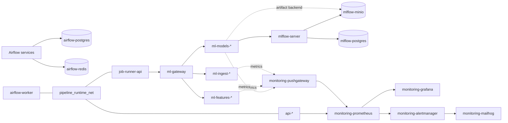

# Local Compose network topology

This document describes the implemented functional network topology for the local
Compose runtimes.

`docker/dev` and `docker/prod` now share the same functional network model. The
network names are runtime-prefixed so both runtimes can run in parallel on the
same host.

## Documentation role

| Document | Role |
| -------- | ---- |
| [`../current-runtime-and-operations/local-prod-runtime.md`](../current-runtime-and-operations/local-prod-runtime.md) | Operational runtime guide, runner API behavior, and workspace ownership. |
| [`runtime-communication-matrix.md`](runtime-communication-matrix.md) | Current service traffic, runner boundary, and communication paths. |
| [`runtime-security-boundaries.md`](runtime-security-boundaries.md) | Runtime identities and security boundaries. |
| [`../current-runtime-and-operations/ports-and-services.md`](../current-runtime-and-operations/ports-and-services.md) | Host exposure and internal-only service inventory. |

## Design principle

The local Compose runtimes do not create one network per service pair. They use
bounded functional domains and allow a few explicit gateway services to join
multiple domains when needed.

A network is justified when at least one of these statements is true:

- it protects stateful backend services such as PostgreSQL, Redis, or MinIO;
- it represents a stable many-to-one communication pattern such as monitoring;
- it separates local support services from pipeline runtime services;
- it carries controlled job-execution concerns such as typed runner API access;
- it allows dev and prod-like runtimes to run in parallel without name conflicts.

## Implemented network families

| Functional domain | Development network | Production-like network | Responsibility |
| ----------------- | ------------------- | ----------------------- | -------------- |
| Orchestration | `dev_orchestration_net` | `prod_orchestration_net` | Airflow control plane, metadata DB, broker, and internal execution API. |
| Pipeline runtime | `dev_pipeline_runtime_net` | `prod_pipeline_runtime_net` | Airflow worker, API refresh, runner API, gateway, and ML step dispatch. |
| Tracking client | `dev_tracking_client_net` | `prod_tracking_client_net` | ML model workloads calling MLflow tracking APIs. |
| Tracking backend | `dev_tracking_backend_net` | `prod_tracking_backend_net` | MLflow server, PostgreSQL backend, MinIO artifact backend, and MinIO init. |
| Observability | `dev_observability_net` | `prod_observability_net` | Metrics push, metrics scrape, dashboards, cAdvisor, and alert routing. |
| Support | `dev_support_net` | `prod_support_net` | Local support services such as MailHog and local alert email routing. |

The previous broad `mlops_net` development model is no longer the implemented
current-state network contract.

## Gateway services

A few services deliberately join multiple networks. These services are not
accidental broad-network members; they bridge bounded domains.

| Service family | Development service | Production-like service | Networks | Gateway role |
| -------------- | ------------------- | ----------------------- | -------- | ------------ |
| Airflow worker | `airflow-worker` | `airflow-worker` | orchestration, pipeline runtime, support | Runs DAG tasks and reaches runtime services that are part of pipeline control. |
| Runner API | `job-runner-api` | `job-runner-api` | pipeline runtime | Accepts typed ML step submissions and delegates them through `ml-gateway`. |
| ML gateway | `ml-gateway` | `ml-gateway` | pipeline runtime | Routes stable runner paths to scaled ML step service replicas. |
| Prediction API | `api-dev` | `api-prod` | pipeline runtime, observability | Receives refresh calls, serves predictions, and exposes metrics. |
| Ingestion service | `ml-ingest-dev` | `ml-ingest-prod` | pipeline runtime, observability | Receives typed ingestion jobs and pushes batch metrics. |
| Feature service | `ml-features-dev` | `ml-features-prod` | pipeline runtime, observability | Receives typed feature jobs and pushes batch metrics. |
| Model service | `ml-models-dev` | `ml-models-prod` | pipeline runtime, tracking client, tracking backend, observability | Receives typed model jobs, logs MLflow evidence, reaches artifact backend, and pushes metrics. |
| MLflow server | `mlflow-server` | `mlflow-server` | tracking client, tracking backend, observability | Accepts tracking API calls and owns backend access to PostgreSQL and MinIO. |
| Pushgateway | `monitoring-pushgateway` | `monitoring-pushgateway` | observability | Receives batch metrics and exposes them for Prometheus scrape. |
| Alertmanager | `monitoring-alertmanager` | `monitoring-alertmanager` | observability, support | Receives Prometheus alerts and can route local email to MailHog. |

## Required service-name dependencies

| Source service | Target service | Dev DNS | Prod-like DNS | Port | Functional network | Reason |
| -------------- | -------------- | ------- | ------------- | ---- | ------------------ | ------ |
| `monitoring-prometheus` | Prediction API | `api-dev` | `api-prod` | `10000` | observability | FastAPI `/metrics` scrape. |
| `monitoring-prometheus` | cAdvisor | `monitoring-cadvisor` | `monitoring-cadvisor` | `8080` | observability | Container metric scrape. |
| `monitoring-prometheus` | Pushgateway | `monitoring-pushgateway` | `monitoring-pushgateway` | `9091` | observability | Batch metric scrape. |
| `monitoring-grafana` | Prometheus | `monitoring-prometheus` | `monitoring-prometheus` | `9090` | observability | Provisioned datasource. |
| Alertmanager | MailHog | `monitoring-mailhog` | `monitoring-mailhog` | `1025` | support | Local alert email capture when enabled. |
| Airflow services | Airflow PostgreSQL | `airflow-postgres` | `airflow-postgres` | `5432` | orchestration | Airflow metadata DB and result backend. |
| Airflow services | Airflow Redis | `airflow-redis` | `airflow-redis` | `6379` | orchestration | Celery broker. |
| Airflow services | Airflow API server | `airflow-api-server` | `airflow-api-server` | `8080` | orchestration | Internal Airflow execution API. |
| Airflow DAG tasks | Prediction API | `api-dev` | `api-prod` | `10000` | pipeline runtime | Authenticated API refresh after successful DAG runs. |
| Airflow DAG tasks | Runner API | `job-runner-api` | `job-runner-api` | `10080` | pipeline runtime | Typed step job submission and status reads. |
| Runner API | ML gateway | `ml-gateway` | `ml-gateway` | `10090` | pipeline runtime | Stable gateway dispatch to scaled ML services. |
| ML gateway | Ingestion service | `ml-ingest-dev` | `ml-ingest-prod` | `10081` | pipeline runtime | Execute validated ingestion jobs. |
| ML gateway | Feature service | `ml-features-dev` | `ml-features-prod` | `10082` | pipeline runtime | Execute validated feature jobs. |
| ML gateway | Model service | `ml-models-dev` | `ml-models-prod` | `10083` | pipeline runtime | Execute validated model jobs. |
| ML step services | Pushgateway | `monitoring-pushgateway` | `monitoring-pushgateway` | `9091` | observability | Push batch job metrics. |
| Model service | MLflow server | `mlflow-server` | `mlflow-server` | `5000` | tracking client | Log runs, metrics, params, model metadata, and registry evidence. |
| Model service | MLflow MinIO | `mlflow-minio` | `mlflow-minio` | `9000` | tracking backend | Reach artifact backend when client artifact locations resolve to MinIO. |
| MLflow server | MLflow PostgreSQL | `mlflow-postgres` | `mlflow-postgres` | `5432` | tracking backend | MLflow backend store. |
| MLflow server | MLflow MinIO | `mlflow-minio` | `mlflow-minio` | `9000` | tracking backend | MLflow artifact store. |
| MinIO init | MLflow MinIO | `mlflow-minio` | `mlflow-minio` | `9000` | tracking backend | Bootstrap the MLflow bucket. |

## Topology sketch



`*` means the service suffix is runtime-specific: `-dev` in `docker/dev` and
`-prod` in `docker/prod`.

## Validation

Network validation is expected through the runtime configuration and local smoke
checks:

```bash
make dev-compose-config
make prod-compose-config
make dev-start DEV_PROFILE=ptf
make prod-start PROD_PROFILE=ptf
make dev-ps
make prod-ps
```

The rendered Compose configuration should show:

- runtime-prefixed networks for both dev and prod-like Compose files;
- `job-runner-api` and `ml-gateway` without host-published ports;
- no Airflow Docker socket mount for normal pipeline execution;
- ML step services on pipeline runtime and observability networks;
- model services also on tracking client and tracking backend networks;
- cAdvisor as the only Docker socket observability exception.
