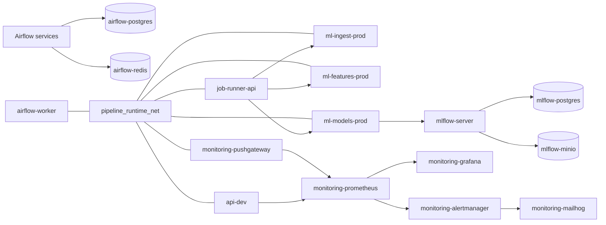

# Local production-like network topology

This document describes the implemented `docker/prod` functional network
topology. It is the reference for current production-like Compose service
placement.

`docker/dev` intentionally keeps its broader development-oriented network model.
`docker/prod` uses bounded functional domains instead of the broad development
`mlops_net`.

## Documentation role

| Document | Role |
| -------- | ---- |
| [`../current-runtime-and-operations/local-prod-runtime.md`](../current-runtime-and-operations/local-prod-runtime.md) | Operational runtime guide, runner API behavior, and workspace ownership. |
| [`runtime-communication-matrix.md`](runtime-communication-matrix.md) | Current service traffic, runner boundary, and communication paths. |
| [`runtime-security-boundaries.md`](runtime-security-boundaries.md) | Runtime identities and security boundaries. |
| [`../current-runtime-and-operations/ports-and-services.md`](../current-runtime-and-operations/ports-and-services.md) | Host exposure and internal-only service inventory. |

## Design principle

The production-like runtime does not create one network per service pair. It uses
bounded functional domains and allows a few edge services to join several domains
when they are explicit gateways.

A network is justified when at least one of these statements is true:

- it protects stateful backend services such as PostgreSQL, Redis, or MinIO;
- it represents a stable many-to-one communication pattern such as monitoring;
- it separates local-development support services from production-like runtime
  services;
- it carries controlled job-execution concerns such as typed runner API access.

## Implemented `docker/prod` networks

| Network | Responsibility | Current members |
| ------- | -------------- | --------------- |
| `orchestration_net` | Airflow control plane, metadata DB, broker, and internal Airflow execution API. | Airflow API, scheduler, DAG processor, triggerer, worker, init, PostgreSQL, Redis. |
| `pipeline_runtime_net` | Runtime control and data-pipeline handoff between orchestration, API refresh, runner API, ML step services, and batch metric writes. | Airflow worker, API, job runner API, ML step services, Pushgateway. |
| `tracking_client_net` | MLflow client API calls from model workloads. | `ml-models-prod` and `mlflow-server`. |
| `tracking_backend_net` | Private MLflow metadata and artifact backends. | `mlflow-server`, `mlflow-postgres`, `mlflow-minio`, `mlflow-mc-init`. |
| `observability_net` | Monitoring, dashboard, alert routing, and scrape access to selected metric endpoints. | Prometheus, Grafana, Alertmanager, cAdvisor, Pushgateway, API metrics endpoint. |
| `dev_support_net` | Local support services that should not be part of the production-like core. | MailHog, Airflow services that send local email, Alertmanager in local email mode. |

`artifact_handoff_net` is not implemented. The current handoff strategy uses
manifests that reference local runtime paths and optional MinIO object URIs.

## Gateway services

A few services deliberately join multiple networks. These services are not
accidental broad-network members; they bridge bounded domains.

| Service | Networks | Gateway role |
| ------- | -------- | ------------ |
| `airflow-worker` | `orchestration_net`, `pipeline_runtime_net`, `dev_support_net` | Runs orchestration tasks and reaches runtime services that are part of pipeline control. |
| `job-runner-api` | `pipeline_runtime_net` | Accepts typed ML step submissions, delegates them to internal ML step services, and exposes internal job status reads. |
| `api-dev` | `pipeline_runtime_net`, `observability_net` | Receives refresh calls and exposes metrics. Host publication remains local ingress. |
| `ml-models-prod` | `pipeline_runtime_net`, `tracking_client_net` | Receives typed model job requests and logs model evidence to MLflow. |
| `mlflow-server` | `tracking_client_net`, `tracking_backend_net`, `observability_net` | Accepts MLflow client calls and owns backend access to PostgreSQL and MinIO. |
| `monitoring-pushgateway` | `pipeline_runtime_net`, `observability_net` | Receives batch metrics writes and exposes them for Prometheus scrape. |
| `monitoring-alertmanager` | `observability_net`, `dev_support_net` | Receives Prometheus alerts and sends local development email. |

This gateway pattern replaces `mlops_net` in the production-like runtime:
cross-domain access is explicit and attached only to services that need it.

## Current dev network review

The development runtime still uses:

| Network | Role in `docker/dev` |
| ------- | -------------------- |
| `airflow_net` | Airflow control plane plus DockerOperator execution context. |
| `mlflow_net` | MLflow tracking and artifact plane. |
| `mlops_net` | Broad local integration network for API, monitoring, Pushgateway, MailHog, cAdvisor, and cross-stack development access. |

This model remains valid for development because it supports broad host
visibility, DockerOperator jobs, and local debugging. It should not be copied
into `docker/prod`.

## Required service-name dependencies

| Source service | Target service | DNS name | Port | Network | Reason |
| -------------- | -------------- | -------- | ---- | ------- | ------ |
| `monitoring-prometheus` | `api-dev` | `api-dev` | `10000` | `observability_net` | FastAPI `/metrics` scrape. |
| `monitoring-prometheus` | `monitoring-cadvisor` | `monitoring-cadvisor` | `8080` | `observability_net` | Container metric scrape. |
| `monitoring-prometheus` | `monitoring-pushgateway` | `monitoring-pushgateway` | `9091` | `observability_net` | Batch metric scrape. |
| `monitoring-grafana` | `monitoring-prometheus` | `monitoring-prometheus` | `9090` | `observability_net` | Provisioned datasource. |
| `monitoring-alertmanager` | `monitoring-mailhog` | `monitoring-mailhog` | `1025` | `dev_support_net` | Local alert email capture. |
| Airflow services | `airflow-postgres` | `airflow-postgres` | `5432` | `orchestration_net` | Airflow metadata DB and result backend. |
| Airflow services | `airflow-redis` | `airflow-redis` | `6379` | `orchestration_net` | Celery broker. |
| Airflow services | `airflow-api-server` | `airflow-api-server` | `8080` | `orchestration_net` | Internal Airflow execution API. |
| Airflow DAG tasks | `api-dev` | `api-dev` | `10000` | `pipeline_runtime_net` | Authenticated API refresh after successful DAG runs. |
| Airflow DAG tasks | `job-runner-api` | `job-runner-api` | `10080` | `pipeline_runtime_net` | Typed step job submission and status reads. |
| Local runner API callers | `job-runner-api` | `job-runner-api` | `10080` | `pipeline_runtime_net` | Typed job submission and status reads. |
| `job-runner-api` | `ml-ingest-prod` | `ml-ingest-prod` | `10081` | `pipeline_runtime_net` | Execute validated ingestion jobs. |
| `job-runner-api` | `ml-features-prod` | `ml-features-prod` | `10082` | `pipeline_runtime_net` | Execute validated feature jobs. |
| `job-runner-api` | `ml-models-prod` | `ml-models-prod` | `10083` | `pipeline_runtime_net` | Execute validated model jobs. |
| ML step services | `monitoring-pushgateway` | `monitoring-pushgateway` | `9091` | `pipeline_runtime_net` | Push batch job metrics. |
| `ml-models-prod` | `mlflow-server` | `mlflow-server` | `5000` | `tracking_client_net` | Log runs, metrics, params, and artifacts. |
| `mlflow-server` | `mlflow-postgres` | `mlflow-postgres` | `5432` | `tracking_backend_net` | MLflow backend store. |
| `mlflow-server` | `mlflow-minio` | `mlflow-minio` | `9000` | `tracking_backend_net` | MLflow artifact store. |
| `mlflow-mc-init` | `mlflow-minio` | `mlflow-minio` | `9000` | `tracking_backend_net` | Bootstrap the MLflow bucket. |

## Services that should not share a broad network

The following services should not be colocated on a single broad production-like
network:

- Airflow PostgreSQL and Redis should not share a platform network with API,
  Grafana, Prometheus, MLflow, or MailHog.
- MLflow PostgreSQL should not share a platform network with Airflow, API,
  monitoring, or local email services.
- MinIO should stay inside the tracking backend boundary unless it becomes an
  explicit artifact handoff boundary with scoped credentials.
- MailHog should remain local-support-only.
- `api-dev` should not share Airflow metadata, Redis, MLflow backend, or MinIO
  backend networks.
- `job-runner-api` should not join tracking or backend networks while its public
  runtime contract remains typed step submission, HTTP delegation, and in-memory
  status tracking.
- Docker socket access should not be introduced in the production-like runtime.

## Topology sketch



## Validation

Network validation is expected through the runtime configuration and local smoke
checks:

```bash
make prod-compose-config
make prod-start
make prod-ps
```

The production-like network config should show `job-runner-api` on
`pipeline_runtime_net` without host-published ports, Docker socket mounts,
tracking backend access, Airflow metadata network access, or broad runtime data
mounts. It should also show the internal ML step services on
`pipeline_runtime_net`, with only `ml-models-prod` joining `tracking_client_net`.
