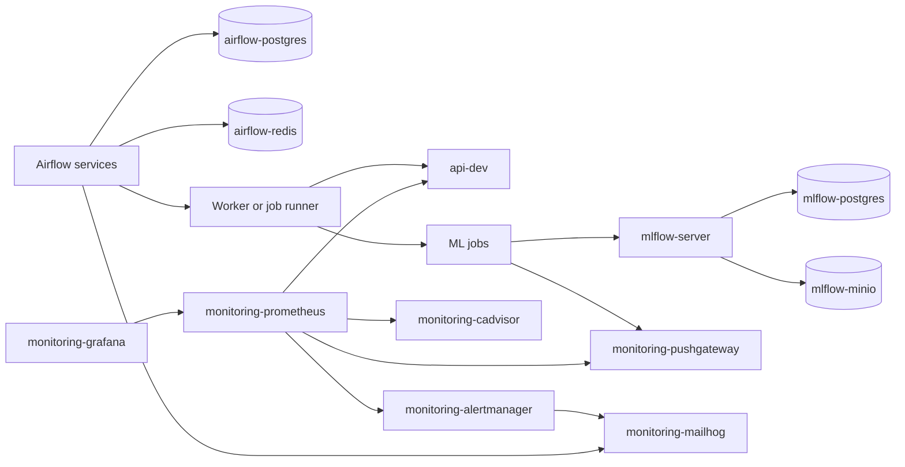

# Local production-like network topology

This document is the Phase 7 design artifact for issue #55. It derives a
target local production-like Docker Compose topology from the current
service-name dependencies.

The current `docker/dev` runtime is intentionally unchanged by this story. The
target network set below is a proposal for a future `docker/prod` or
`docker/local-prod` Compose implementation.

## Scope and inputs

The design reviews these runtime sources:

| Source | Use in this design |
| ------ | ------------------ |
| `docker-compose.yaml` | Current services, networks, mounts, and host exposure. |
| `.env.template` | Runtime names, ports, credentials, and local defaults. |
| `docs/runtime-communication-matrix.md` | Current service traffic and host exposure. |
| `docs/runtime-security-boundaries.md` | Runtime identities and boundary intent. |
| `docs/repository-structure.md` | `docker/dev` stability and future `docker/prod` split. |
| `docs/ports-and-services.md` | Host URLs and internal-only service ports. |
| `docker/dev/prometheus/prometheus.yml` | Prometheus scrape and alert routing targets. |
| `docker/dev/grafana/provisioning/datasources/datasource.yaml` | Grafana to Prometheus service-name dependency. |
| `docker/dev/airflow/config/connections.json` | Airflow `api_dev` HTTP target. |
| `docker/dev/airflow/config/variables.json` | DockerOperator images, network, MLflow, MinIO, and Pushgateway values. |

The goal is network design only. It does not implement secrets, ingress,
Kubernetes, worker execution replacement, or a Compose refactor.

## Design principle

The target model does not create one network per service pair. It uses bounded
functional domains and allows a few edge services to join several domains when
they are explicit gateways.

A new network is justified only when at least one of these statements is true:

- it protects stateful backend services such as PostgreSQL, Redis, or MinIO;
- it represents a stable many-to-one communication pattern such as monitoring;
- it separates local-development support services from production-like runtime
  services;
- it carries privileged job-execution concerns such as Docker socket access or a
  future job runner.

Small two-service links should be avoided unless they protect sensitive state or
privileged control surfaces. The target topology should remain readable with a
small number of networks.

## Current network review

### `airflow_net`

`airflow_net` is the Airflow control-plane network. It correctly groups the
Airflow API server, scheduler, DAG processor, triggerer, worker, Flower,
Airflow PostgreSQL, Redis, initialization task, and Airflow-managed jobs.

Target decision:

- keep Airflow metadata and broker services internal to an orchestration
  boundary;
- keep Airflow UI/API access as an explicit host or ingress concern, not a
  shared platform network concern;
- remove broad Airflow-to-platform attachment in the target model unless a
  documented DAG dependency needs it;
- treat `airflow-worker` Docker socket access as a local-dev exception until a
  worker-pool or job-runner story replaces it.

`api-dev` does not need to share the Airflow metadata network only to receive
`POST /admin/refresh`. That call should use the standard API authentication over
an internal Compose runtime network, resolving `api-dev:10000` through Docker
service DNS. The host-published API port remains a local operator ingress and
should not be the default container-to-container path.

### `mlflow_net`

`mlflow_net` is the ML tracking and artifact boundary. It correctly groups
`mlflow-server`, `mlflow-postgres`, `mlflow-minio`, the MinIO bootstrap helper,
and ML workloads that log tracking data or artifacts.

Target decision:

- keep `mlflow-postgres` private to tracking backend services;
- keep `mlflow-minio` private to tracking/artifact services by default;
- attach ML workloads through an explicit tracking client boundary;
- avoid exposing tracking backend services on a broad integration network;
- expose local MLflow and MinIO UIs only through deliberate local host or dev
  ingress paths.

A split between tracking clients and tracking backends is justified because ML
jobs need `mlflow-server`, but they do not need direct PostgreSQL access.

### `mlops_net`

`mlops_net` is currently a broad local integration network. It is useful for
development because it groups API, monitoring, Pushgateway, MailHog, cAdvisor,
and selected cross-stack services.

Target decision:

- do not keep `mlops_net` as a broad local production-like network;
- replace it with a small set of functional domains rather than many pairwise
  links;
- keep the name only as a legacy `docker/dev` concept, or rename it to
  `dev_integration_net` if a future cleanup wants to make its purpose explicit;
- do not migrate the name into `docker/prod` unless it is narrowed to a single
  responsibility.

## Proposed network set

The recommended target uses five core networks and one optional future boundary.
This keeps the Compose model bounded while still removing the broad `mlops_net`
behavior.

| Network | Responsibility | Expected members |
| ------- | -------------- | ---------------- |
| `orchestration_net` | Airflow control plane, metadata DB, broker, and internal Airflow execution API. | Airflow API, scheduler, DAG processor, triggerer, worker, init, Flower, PostgreSQL, Redis. |
| `pipeline_runtime_net` | Runtime control and data-pipeline handoff between orchestration, API refresh, batch jobs, and batch metric writes. | Airflow worker or future job runner, `api-dev`, `ml-ingest-*`, `ml-features-*`, `ml-models-*`, `monitoring-pushgateway`. |
| `tracking_client_net` | MLflow client API calls from ML workloads. | ML jobs and `mlflow-server`. |
| `tracking_backend_net` | Private MLflow metadata and artifact backends. | `mlflow-server`, `mlflow-postgres`, `mlflow-minio`, `mlflow-mc-init`. |
| `observability_net` | Monitoring, dashboard, alert-routing, and scrape access to selected metric endpoints. | Prometheus, Grafana, Alertmanager, cAdvisor, Pushgateway, API metrics endpoint, selected exporters. |
| `dev_support_net` | Local development support services that should not be part of the production-like core. | MailHog, Airflow services that send local email, Alertmanager in local email mode. |
| `artifact_handoff_net` | Optional future object-store or release handoff boundary if host bind mounts are replaced. | API, ML jobs, Airflow promotion step, and storage service when implemented. |

`artifact_handoff_net` should not be created only for the current host bind
mounts. It becomes useful if a future story replaces broad `data`, `models`, or
`logs` mounts with an object store or an explicit release service.

## Gateway services

A few services deliberately join multiple networks. These services are not
accidental broad-network members; they bridge bounded domains.

| Service | Target networks | Gateway role |
| ------- | --------------- | ------------ |
| `airflow-worker` or future job runner | `orchestration_net`, `pipeline_runtime_net`, optional `dev_support_net` | Runs or triggers jobs, calls API refresh, and remains connected to the Airflow control plane. |
| `api-dev` | `pipeline_runtime_net`, `observability_net`, optional ingress or host port | Receives authenticated refresh calls and exposes metrics. Host publication remains local ingress, not the container-to-container path. |
| `mlflow-server` | `tracking_client_net`, `tracking_backend_net` | Accepts MLflow client calls and owns backend access to PostgreSQL and MinIO. |
| `monitoring-pushgateway` | `pipeline_runtime_net`, `observability_net` | Receives batch metrics writes and exposes them for Prometheus scrape. |
| `monitoring-alertmanager` | `observability_net`, `dev_support_net` | Receives Prometheus alerts and sends local development email. |

This gateway pattern is the replacement for `mlops_net`: cross-domain access is
explicit and attached only to services that need it.

## Required service-name dependencies

| Source service | Target service | DNS name | Port | Protocol | Reason | Proposed network |
| -------------- | -------------- | -------- | ---- | -------- | ------ | ---------------- |
| `monitoring-prometheus` | `monitoring-prometheus` | `monitoring-prometheus` | `9090` | HTTP | Self scrape and readiness checks. | `observability_net` |
| `monitoring-prometheus` | `monitoring-cadvisor` | `monitoring-cadvisor` | `8080` | HTTP | Container metric scrape. | `observability_net` |
| `monitoring-prometheus` | `api-dev` | `api-dev` | `10000` | HTTP | FastAPI `/metrics` scrape. | `observability_net` |
| `monitoring-prometheus` | `monitoring-pushgateway` | `monitoring-pushgateway` | `9091` | HTTP | Batch metric scrape. | `observability_net` |
| `monitoring-prometheus` | `monitoring-alertmanager` | `monitoring-alertmanager` | `9093` | HTTP | Alert routing target. | `observability_net` |
| `monitoring-grafana` | `monitoring-prometheus` | `monitoring-prometheus` | `9090` | HTTP | Provisioned datasource. | `observability_net` |
| `monitoring-alertmanager` | `monitoring-mailhog` | `monitoring-mailhog` | `1025` | SMTP | Local alert email test route. | `dev_support_net` |
| Airflow services | `airflow-postgres` | `airflow-postgres` | `5432` | PostgreSQL | Airflow metadata DB and result backend. | `orchestration_net` |
| Airflow services | `airflow-redis` | `airflow-redis` | `6379` | Redis | Celery broker. | `orchestration_net` |
| Airflow services | `airflow-api-server` | `airflow-api-server` | `8080` | HTTP | Internal Airflow execution API. | `orchestration_net` |
| Airflow DAG tasks | `api-dev` | `api-dev` | `10000` | HTTP | Authenticated API refresh after successful DAG runs. | `pipeline_runtime_net` |
| Airflow DAG tasks | ML job containers | Docker API | N/A | Docker API | Create ingestion, features, and model jobs. | `pipeline_runtime_net` |
| Airflow services | `monitoring-mailhog` | `monitoring-mailhog` | `1025` | SMTP | Local Airflow email capture. | `dev_support_net` |
| ML jobs | `monitoring-pushgateway` | `monitoring-pushgateway` | `9091` | HTTP | Push batch job metrics. | `pipeline_runtime_net` |
| ML jobs | `mlflow-server` | `mlflow-server` | `5000` | HTTP | Log runs, metrics, params, and artifacts. | `tracking_client_net` |
| `mlflow-server` | `mlflow-postgres` | `mlflow-postgres` | `5432` | PostgreSQL | MLflow backend store. | `tracking_backend_net` |
| `mlflow-server` | `mlflow-minio` | `mlflow-minio` | `9000` | HTTP/S3 | MLflow artifact store. | `tracking_backend_net` |
| `mlflow-mc-init` | `mlflow-minio` | `mlflow-minio` | `9000` | HTTP/S3 | Bootstrap the MLflow bucket. | `tracking_backend_net` |
| API and ML jobs | promoted datasets | No DNS | N/A | Filesystem or S3 | Read/write released prediction artifacts. | Optional `artifact_handoff_net` |

The Docker API entry is a logical dependency. It is not a Compose DNS
dependency, but it must stay visible in the migration plan because the current
Airflow worker creates ML workload containers through the local Docker socket.

## Why monitoring uses one observability boundary

Prometheus is intentionally a many-to-one scraper. Its checked-in configuration
uses service names for several targets, and future exporters will likely follow
the same pattern.

A pairwise network per Prometheus target would create operational noise:

- every new exporter would require a new Compose network;
- Prometheus would need one extra attachment per target;
- target removals would require network lifecycle cleanup;
- dashboard and alert validation would become harder to reason about.

A shared `observability_net` is the better local production-like boundary when
it is limited to scrape endpoints, dashboard queries, alert routing, and selected
exporters. It keeps service discovery maintainable while avoiding broad
application, database, broker, and artifact-store colocation.

`monitoring-pushgateway` is the main bridge between `pipeline_runtime_net` and
`observability_net`: jobs write metrics on the pipeline side, and Prometheus
scrapes metrics on the observability side.

## Pairwise network policy

The target design avoids pairwise networks by default. A pairwise network is
justified only when the target contains sensitive backend state or a privileged
runtime surface.

Current strong candidates for narrow isolation are:

- Airflow metadata DB and Redis inside `orchestration_net`;
- MLflow PostgreSQL and MinIO inside `tracking_backend_net`;
- Docker socket or replacement job runner access inside `pipeline_runtime_net`;
- local SMTP capture isolated in `dev_support_net`.

Monitoring does not qualify for pairwise links in this design because it has a
stable many-target scrape pattern.

## Services that should not share a broad network

The following services should not be colocated on a single broad network in a
local production-like runtime:

- `airflow-postgres` and `airflow-redis` should not share a platform network
  with API, Grafana, Prometheus, MLflow, or MailHog.
- `mlflow-postgres` should not share a platform network with Airflow, API,
  monitoring, or local email services.
- `mlflow-minio` should not share a broad network unless it becomes an explicit
  project object-store boundary with scoped credentials.
- `monitoring-cadvisor` should not share orchestration metadata or tracking
  backend networks because it observes runtime internals.
- `monitoring-mailhog` should remain dev-only and isolated from production-like
  serving and tracking networks.
- `api-dev` should not share Airflow metadata, Redis, MLflow backend, or MinIO
  backend networks.
- `airflow-worker` Docker socket access should not be combined with a broad
  all-services integration network.

## Target topology sketch



This sketch shows functional dependencies only. It is not an implementation
diff for `docker/dev`.

## Migration sequence

1. Keep `docker/dev` unchanged and treat this document as the target contract.
2. Create a separate `docker/prod` or `docker/local-prod` Compose entrypoint.
3. Add the target network names without removing existing service definitions.
4. Move Airflow metadata and broker services to `orchestration_net`.
5. Create `pipeline_runtime_net` for Airflow worker or job runner, API refresh,
   ML job containers, and Pushgateway writes.
6. Move MLflow backend services to `tracking_backend_net`; attach ML jobs only
   to `mlflow-server` through `tracking_client_net`.
7. Replace the monitoring slice of `mlops_net` with `observability_net`.
8. Move local SMTP capture to `dev_support_net` and keep it dev-only.
9. Define the artifact handoff contract before removing broad `data`, `models`,
   or `logs` bind mounts.
10. Remove `mlops_net` from the target runtime only after all service-name
    dependencies resolve through the new functional domains.
11. Update architecture diagrams and operator documentation after validation.

## Rollback criteria

Rollback to the previous Compose topology or temporarily reattach the legacy
integration network if any of these conditions occur:

- `make compose-config` or `docker compose config` fails;
- Prometheus cannot resolve or scrape expected targets;
- Grafana cannot resolve or query Prometheus;
- Alertmanager cannot receive alerts from Prometheus;
- MailHog no longer receives local Airflow or Alertmanager email;
- Airflow cannot reach PostgreSQL, Redis, the internal API server, or the API
  refresh endpoint;
- Airflow-created ML jobs cannot start or cannot join required networks;
- ML jobs cannot log to MLflow or push metrics to Pushgateway;
- `mlflow-server` cannot reach PostgreSQL or MinIO;
- `api-dev` cannot read promoted prediction artifacts or expose `/metrics`.

## Validation commands

The documentation-only validation for this story remains:

```bash
make compose-config
```

Future implementation stories should also validate service-name resolution and
runtime readiness with commands like:

```bash
docker compose config
docker compose --profile ptf up -d
docker compose ps
docker compose exec monitoring-prometheus \
    wget -qO- http://api-dev:10000/metrics
docker compose exec monitoring-prometheus \
    wget -qO- http://monitoring-alertmanager:9093/-/ready
docker compose exec monitoring-grafana \
    wget -qO- http://monitoring-prometheus:9090/-/ready
docker compose exec airflow-worker getent hosts api-dev
docker compose exec airflow-worker getent hosts monitoring-pushgateway
docker compose exec mlflow-server getent hosts mlflow-postgres
docker compose exec mlflow-server getent hosts mlflow-minio
```

## Out-of-scope items

This design does not:

- refactor the current `docker/dev` runtime;
- implement `docker/prod`;
- replace Airflow worker execution;
- implement secrets or production ingress;
- remove host bind mounts;
- change monitoring, alerting, MLflow, MinIO, API, or Airflow service config.
