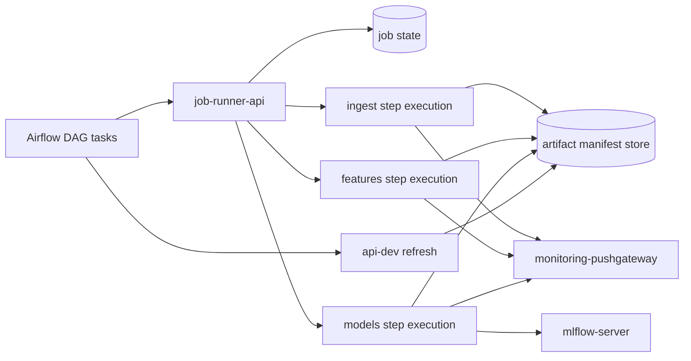

# Airflow job runner strategy

This document coordinates the remaining Phase 8 work for production-like Airflow
orchestration after typed ML step execution was added to `job-runner-api`.

Current runtime and architecture references describe what is already implemented.
This document keeps only the open DAG orchestration path and validation targets.

## Scope and inputs

| Source | Use in this design |
| ------ | ------------------ |
| [`../README.md`](../README.md) | Documentation hierarchy and level rules. |
| [`../current-runtime-and-operations/local-prod-runtime.md`](../current-runtime-and-operations/local-prod-runtime.md) | Current dev/prod runtime split and runner API operation. |
| [`../architecture-references/runtime-communication-matrix.md`](../architecture-references/runtime-communication-matrix.md) | Current communication paths, runner boundary, and network traffic. |
| [`../architecture-references/runtime-security-boundaries.md`](../architecture-references/runtime-security-boundaries.md) | Runtime identities, Docker socket risk, and implemented service boundaries. |
| [`../architecture-references/local-prod-network-topology.md`](../architecture-references/local-prod-network-topology.md) | Implemented functional networks and service placement. |
| [`artifact-handoff-strategy.md`](artifact-handoff-strategy.md) | Manifest-first artifact handoff contract and open artifact gaps. |
| [`../current-runtime-and-operations/repository-structure.md`](../current-runtime-and-operations/repository-structure.md) | DAG placement rules and the `docker/dev` versus `docker/prod` split. |

## Implemented runner boundary

The production-like runtime includes an internal `job-runner-api` FastAPI
service. It exposes:

- `GET /health` for service health;
- `POST /jobs` for one typed ML step request;
- `GET /jobs/{job_id}` for current job status.

The active request and status contracts live under `src/ml/jobs`. Accepted job
types are `ingest`, `features`, and `models`. The runner does not expose a
pipeline-wide runtime job.

Submitted jobs are stored in memory and executed synchronously through the local
runner adapter. The runner records `queued`, `running`, and terminal `succeeded`
or `failed` states. Successful jobs return `JobResult` evidence with output
paths, optional metrics evidence, and optional artifact manifest references.
Controlled step failures are mapped to structured `JobError` payloads.

The service remains intentionally narrow. It is not a durable queue, worker pool,
distributed execution platform, Docker SDK wrapper, Kubernetes controller, or
full-pipeline scheduler.

## Remaining production-like orchestration decision

Airflow owns pipeline orchestration.

The runner owns execution control for one allow-listed typed ML step at a time.
The production-like execution path should therefore use three visible Airflow
steps:

1. submit and observe an ingest job;
2. submit and observe a feature engineering job;
3. submit and observe a model training and prediction job.

This keeps the ML chain observable and retryable from Airflow without giving
Airflow access to the Docker socket or Docker SDK.

## Development execution model

The current local development model still uses Airflow as both orchestrator and
container launcher:

1. Airflow imports variables and connections during `airflow-init`.
2. DAG tasks read Docker image names, network names, MLflow endpoints, MinIO
   credentials, Pushgateway address, and UID/GID values from Airflow variables.
3. The development Airflow worker mounts `/var/run/docker.sock`.
4. The development Airflow worker starts ML containers for ingestion, feature
   engineering, training, and prediction.
5. ML containers read and write shared `data`, `logs`, and `models` paths.
6. Model jobs log run evidence to MLflow and push batch metrics to Pushgateway.
7. Airflow calls the FastAPI admin refresh endpoint after successful runs.

This model is practical for local development because it reuses existing Docker
images and keeps artifacts visible on the host. It is not the production-like job
boundary and should remain dev-only.

## Why broad container-runtime access is not production-like

A container with write access to the Docker socket can ask the host Docker daemon
to create containers, mount host paths, join networks, and access data or secrets
available to the daemon.

The development `airflow-worker` therefore mixes two responsibilities:

- orchestration: schedule tasks, track dependencies, expose retries, and keep DAG
  state;
- execution control: create runtime containers with host-level Docker privileges.

| Concern | Development behavior | Production-like target behavior |
| ------- | -------------------- | ------------------------------- |
| Privilege boundary | Airflow worker can control the host container runtime. | Airflow can call only the narrow job-runner API. |
| Runtime user | Worker uses a root entrypoint to align Docker socket access. | Airflow and ML execution run without Docker socket access. |
| Network scope | Jobs inherit networks selected by Airflow variables. | Jobs run through predefined functional networks and runner contracts. |
| Command scope | DAG code can construct container commands. | Runner accepts only allow-listed step job types and arguments. |
| Artifact scope | Jobs write broad host-mounted folders. | Jobs publish through manifest-first artifact handoff. |
| Observability | DockerOperator status is mixed with container logs. | Airflow sees each ML step and runner status explicitly. |

## Workload model

The production-like DAG must cover the existing ML step shape:

| Job type | Runner action | Main outputs | External dependencies |
| -------- | ------------- | ------------ | --------------------- |
| `ingest` | Execute the ingestion entrypoint. | Interim data, manifest, and ingest metrics. | Raw data, runtime data workspace, logs, Pushgateway. |
| `features` | Execute the feature entrypoint. | Processed features, manifest, and feature metrics. | Interim data, runtime data workspace, logs, Pushgateway. |
| `models` | Execute the model entrypoint. | Forecasts, model artifacts, MLflow runs, prediction manifest. | Processed data, runtime data/model workspace, logs, MLflow, Pushgateway. |

The runner should not add a `pipeline` workload. The init and daily DAGs keep
their business responsibility: choose counters, derive ranges or dates, trigger
jobs in the right order, apply retries, and decide whether downstream refresh is
allowed.

## Target architecture

The diagram shows step-level runner execution. Airflow remains the component that
orders the ML chain. The current runtime topology is kept in
[`../architecture-references/local-prod-network-topology.md`](../architecture-references/local-prod-network-topology.md).

## Runner API contract used by Airflow

Airflow submits a typed step job request to `job-runner-api`. The request
includes:

- `dag_id`;
- `task_id`;
- `run_id`;
- `try_number`;
- `counter_id`;
- `job_type`;
- validated step business parameters;
- expected input and output artifact references where relevant.

The API validates the request, assigns or reuses a `job_id`, records job state,
executes the step, and returns a typed `JobStatus`.

The current API keeps state in memory. Airflow retries should create distinct
external attempts by including `try_number` in the idempotency key.
Re-submitting the same key should return the existing `job_id` instead of
duplicating work.

## Production-like DAG responsibility

The production-like DAG should:

- build typed business specs for each ML step;
- submit each step to `job-runner-api`;
- wait for each step terminal state;
- map runner failure to Airflow failure;
- call API refresh through the existing HTTP connection after model success;
- preserve DAG-level retry, schedule, and dependency semantics.

DAG code should stay near Airflow runtime assets under `docker/dev` or
`docker/prod` unless the project later decides to package DAGs as importable
application modules. Reusable client or schema logic may live under `src/` with
tests, but deployment-specific DAG wiring should remain close to the Airflow
runtime that consumes it.

## Init and daily DAG trigger flow

### Initial load DAG

1. Read `bike_dag_config.json`.
2. For each configured counter, submit `ingest`.
3. Submit `features` only after the matching ingest job succeeds.
4. Submit `models` only after the matching feature job succeeds.
5. Refresh final prediction data only after required model outputs are promoted.
6. Fail the Airflow run if any required runner job fails.

### Daily DAG

1. Compute the daily range or business window.
2. Submit `ingest` with the daily range and counter configuration.
3. Submit `features` only after the matching ingest job succeeds.
4. Submit `models` only after the matching feature job succeeds.
5. Refresh final prediction data only after successful model jobs.
6. Keep Airflow retries at the orchestration layer while the runner records every
   external job attempt.

In both flows, Airflow never asks Docker to start a container. It only asks the
runner API to handle typed business step jobs.

## Implementation progress

| Capability | Status | Source of truth |
| ---------- | ------ | --------------- |
| Artifact manifest models and store | Implemented | [`artifact-handoff-strategy.md`](artifact-handoff-strategy.md) |
| Local ML manifest emission | Implemented | [`artifact-handoff-strategy.md`](artifact-handoff-strategy.md) |
| Typed step job requests and statuses | Implemented | `src/ml/jobs/` |
| Internal runner API boundary | Implemented | `src/job_runner/` and runtime docs |
| Step-level ML execution through the runner | Implemented | `src/job_runner/` |
| Production-like Airflow DAG using step runner jobs | Open | This document |
| API serving from promoted manifests | Open | [`artifact-handoff-strategy.md`](artifact-handoff-strategy.md) |
| Production-like smoke validation | Open | Active validation work |
| Runtime configuration and secret validation | Open | Active runtime hardening work |

## Open design gaps

- Airflow still needs a production-like DAG path that submits step-level runner
  jobs.
- The API still needs to serve predictions through promoted manifests.
- Runner metrics and Prometheus scrape integration are not implemented.
- Job status is in memory and is not durable across process restarts.
- Configuration validation still needs to reject unsafe placeholder values for
  custom services.

## Validation target

A complete validation should prove that:

- `docker/prod` Airflow has no Docker socket mount;
- Airflow can submit typed step jobs to `job-runner-api`;
- the runner can execute each ML step without exposing Docker runtime control to
  Airflow;
- each ML step emits coherent artifact manifests;
- Airflow chains ingest, features, and models visibly;
- the API serves predictions by reading the promoted manifest;
- Prometheus/Grafana can observe job status and artifact freshness.

The current runner API boundary and synchronous step execution are validated with
focused API tests covering health, valid submission, invalid payloads, status
retrieval, duplicate job IDs, failure mapping, and not-found behavior.
