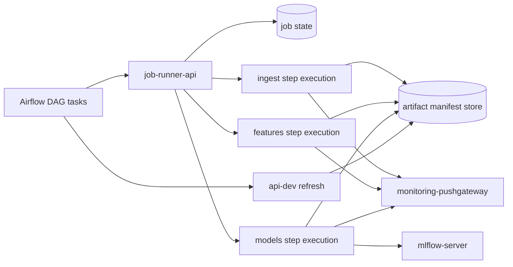

# Airflow job runner strategy

This document coordinates the active design for replacing DockerOperator-based ML
execution in the local production-like runtime.

The current runtime and architecture references describe what is implemented and
how it is wired. This document keeps the runner execution design, the open gaps,
and the coordination rules for the work that is still in progress.

## Scope and inputs

| Source | Use in this design |
| ------ | ------------------ |
| [`../README.md`](../README.md) | Documentation hierarchy and level rules. |
| [`../current-runtime-and-operations/local-prod-runtime.md`](../current-runtime-and-operations/local-prod-runtime.md) | Current dev/prod runtime split and runner API operation. |
| [`../architecture-references/runtime-communication-matrix.md`](../architecture-references/runtime-communication-matrix.md) | Current communication paths and network traffic. |
| [`../architecture-references/runtime-security-boundaries.md`](../architecture-references/runtime-security-boundaries.md) | Runtime identities, Docker socket risk, and implemented service boundaries. |
| [`../architecture-references/local-prod-network-topology.md`](../architecture-references/local-prod-network-topology.md) | Implemented functional networks and service placement. |
| [`artifact-handoff-strategy.md`](artifact-handoff-strategy.md) | Manifest-first artifact handoff contract and open artifact gaps. |
| [`artifact-manifest-store.md`](artifact-manifest-store.md) | Implemented promotion helpers used by ML step execution. |
| [`ml-step-runner-boundary.md`](ml-step-runner-boundary.md) | Boundary decision for step-level runner execution. |
| [`../current-runtime-and-operations/repository-structure.md`](../current-runtime-and-operations/repository-structure.md) | DAG placement rules and the `docker/dev` versus `docker/prod` split. |

## Current runner boundary

The production-like runtime includes an internal `job-runner-api` FastAPI
service. It provides the API boundary needed before real step execution is added.

Implemented behavior:

- `GET /health` returns a simple service health response;
- `POST /jobs` validates typed job requests from `src/pipeline/contracts/jobs.py`;
- `GET /jobs/{job_id}` returns the current `JobStatus` from
  `src/pipeline/contracts/statuses.py`;
- accepted jobs are stored in memory;
- accepted jobs stay in `queued` state;
- caller-provided `job_id` values are reused when present;
- runner-generated IDs are explicit and deterministic for the in-memory process;
- not-found errors use an explicit structured response;
- the API imports no Airflow, Docker SDK, or concrete container runtime code.

The service is an internal local production-like bridge. It is not a durable
queue, worker pool, distributed execution platform, or full-pipeline scheduler.

## Decision summary

Airflow owns pipeline orchestration.

The runner owns execution control for one allow-listed typed ML step at a time.
It should not receive a whole business pipeline as one opaque runtime job.

The production-like execution path should therefore use three visible Airflow
steps:

1. submit and observe an ingest job;
2. submit and observe a feature engineering job;
3. submit and observe a model training and prediction job.

This keeps the ML chain observable and retryable from Airflow without giving
Airflow access to the Docker socket or Docker SDK.

The `PipelineJobRequest` concept should no longer grow as the primary runtime
contract. It may be removed or kept temporarily for compatibility, but the active
production-like path should rely on step-level requests.

## Current Airflow-triggered execution model in development

The current local development model uses Airflow as both orchestrator and
container launcher:

1. Airflow imports variables and connections during `airflow-init`.
2. DAG tasks read Docker image names, network names, MLflow endpoints, MinIO
   credentials, Pushgateway address, and UID/GID values from Airflow variables.
3. The development Airflow worker mounts `/var/run/docker.sock`.
4. The development Airflow worker starts ML containers for ingestion, feature
   engineering, training, and prediction.
5. ML containers read and write shared `data`, `logs`, and `models` paths.
6. Model jobs log run evidence to MLflow and push batch metrics to Pushgateway.
7. Airflow calls the FastAPI admin refresh endpoint after successful runs.

This model is practical for local development because it reuses existing Docker
images and keeps artifacts visible on the host. It is not a production-like job
boundary and should remain dev-only.

## Why broad container-runtime access is not production-like

A container with write access to the Docker socket can ask the host Docker daemon
to create containers, mount host paths, join networks, and access data or secrets
available to the daemon.

The development `airflow-worker` therefore mixes two responsibilities:

- orchestration: schedule tasks, track dependencies, expose retries, and keep DAG
  state;
- execution control: create runtime containers with host-level Docker privileges.

| Concern | Development behavior | Production-like target behavior |
| ------- | -------------------- | ------------------------------- |
| Privilege boundary | Airflow worker can control the host container runtime. | Airflow can call only a narrow job submission interface. |
| Runtime user | Worker uses a root entrypoint to align Docker socket access. | Airflow and ML execution run without Docker socket access. |
| Network scope | Jobs inherit networks selected by Airflow variables. | Jobs run on predefined functional networks. |
| Command scope | DAG code can construct container commands. | Runner accepts only allow-listed step job types and arguments. |
| Artifact scope | Jobs write broad host-mounted folders. | Jobs publish through manifest-first artifact handoff. |
| Observability | DockerOperator status is mixed with container logs. | Airflow sees each ML step and runner status explicitly. |

## Workload model

The runner must cover the existing ML step shape:

| Job type | Current dev image or action | Main outputs | External dependencies |
| -------- | --------------------------- | ------------ | --------------------- |
| `ingest` | `ml-ingest-dev` | Interim data, manifest, and ingest metrics. | Raw data, runtime data workspace, logs, Pushgateway. |
| `features` | `ml-features-dev` | Processed features, manifest, and feature metrics. | Interim data, runtime data workspace, logs, Pushgateway. |
| `models` | `ml-models-dev` | Forecasts, model artifacts, MLflow runs, prediction manifest. | Processed data, runtime data/model workspace, logs, MLflow, Pushgateway. |

The runner should not add a `pipeline` runtime workload. The init and daily DAGs
should keep their business responsibility: choose counters, derive ranges or
dates, trigger jobs in the right order, apply retries, and decide whether
downstream refresh is allowed.

## Target architecture



The diagram shows step-level runner execution. Airflow remains the component that
orders the ML chain. The current runtime topology is kept in
[`../architecture-references/local-prod-network-topology.md`](../architecture-references/local-prod-network-topology.md).

## Typed job contracts

The framework-neutral contracts are currently implemented under:

```text
src/pipeline/contracts/
├── __init__.py
├── jobs.py
└── statuses.py
```

They are Pydantic models used to describe payloads exchanged between Airflow,
the runner API, and ML step execution code. They deliberately do not import
Airflow, Docker SDK, FastAPI application instances, or runner implementation
code.

Implemented request contracts include:

- `IngestJobRequest`;
- `FeatureJobRequest`;
- `ModelJobRequest`;
- `PipelineJobRequest`.

The active production-like path should use only the step-level request contracts.
`PipelineJobRequest` should be treated as a compatibility/deprecation concern,
not as the target runtime job shape.

These contracts are ML-specific despite their current `src/pipeline/contracts`
location. A future refactor may move or alias them under an ML-specific namespace
such as `src/ml/contracts` or `src/ml/jobs` after open stories are aligned.

Implemented status and result contracts include:

- `JobStatus`;
- `JobResult`;
- `JobError`;
- `MetricsEvidence`.

## Runner API contract

Airflow submits a typed step job request to `job-runner-api`. The request
includes:

- `dag_id`;
- `task_id`;
- `run_id`;
- `try_number`;
- `counter_id`;
- `job_type`;
- validated step business parameters;
- expected input and output artifact references where relevant.

The API validates the request, assigns or reuses a `job_id`, records job state,
and returns a typed `JobStatus`.

The current API keeps state in memory. The execution implementation must keep the
same external contract while adding controlled step dispatch and state
transitions.

## Worker execution design

The execution path should use typed workers or typed execution adapters:

| Worker or execution path | Accepted jobs | Service-specific constraints |
| ------------------------ | ------------- | ---------------------------- |
| Ingestion execution | `ingest` only | Raw and interim data access, ingest configuration, Pushgateway metrics. |
| Feature execution | `features` only | Interim and processed data access, feature configuration, Pushgateway metrics. |
| Model execution | `models` only | Processed/final data, model artifacts, MLflow, optional MinIO/S3 credentials, Pushgateway metrics. |

Execution paths may share a common job protocol:

- validate the job payload with a typed schema;
- resolve safe step arguments from an allow-list;
- execute one business entrypoint;
- publish status, logs, metrics, and artifact references.

They should not share one broad runtime configuration. Service-specific
dependencies, environment variables, mounted paths, network attachments,
healthchecks, and resource limits should remain explicit per step type.

## Job state model

The shared `JobState` enum currently supports:

| State | Meaning | Airflow behavior |
| ----- | ------- | ---------------- |
| `pending` | Request was created but not yet queued. | Continue polling. |
| `queued` | Job is accepted and waiting for execution. | Continue polling or sensor deferral. |
| `running` | Execution started. | Continue polling and link logs. |
| `succeeded` | Step exited successfully and outputs were published. | Mark the current Airflow task successful. |
| `failed` | Step failed with a controlled error. | Fail the Airflow attempt. |
| `canceled` | Job was canceled by operator or cleanup policy. | Fail or skip according to DAG policy. |
| `expired` | Job exceeded retention or timeout. | Fail with an explicit timeout reason. |

Airflow retries should create distinct external attempts by including
`try_number` in the idempotency key. Re-submitting the same key should return the
existing `job_id` instead of duplicating work.

## Impact on Airflow DAGs

Development DAG responsibility:

- build container commands;
- select Docker images and networks;
- pass MLflow, MinIO, Pushgateway, UID, and GID variables;
- wait for the container exit code;
- call API refresh after successful jobs.

Production-like DAG responsibility:

- build typed business specs for each ML step;
- submit each step to `job-runner-api`;
- wait for each step terminal state;
- map runner failure to Airflow failure;
- call API refresh through the existing HTTP connection after model success;
- preserve DAG-level retry, schedule, and dependency semantics.

DAG code should stay near Airflow runtime assets under `docker/dev` or
`docker/prod` unless the project later decides to package DAGs as importable
application modules. Reusable client or schema logic may live under `src/` with
tests, but deployment-specific DAG wiring should remain close to the Airflow
runtime that consumes it.

## Init and daily DAG trigger flow

### Initial load DAG

1. Read `bike_dag_config.json`.
2. For each configured counter, submit `ingest`.
3. Submit `features` only after the matching ingest job succeeds.
4. Submit `models` only after the matching feature job succeeds.
5. Refresh final prediction data only after required model outputs are promoted.
6. Fail the Airflow run if any required runner job fails.

### Daily DAG

1. Compute the daily range or business window.
2. Submit `ingest` with the daily range and counter configuration.
3. Submit `features` only after the matching ingest job succeeds.
4. Submit `models` only after the matching feature job succeeds.
5. Refresh final prediction data only after successful model jobs.
6. Keep Airflow retries at the orchestration layer while the runner records every
   external job attempt.

In both flows, Airflow never asks Docker to start a container. It only asks the
runner API to handle typed business step jobs.

## Implementation progress

| Capability | Status | Source of truth |
| ---------- | ------ | --------------- |
| Artifact manifest models | Implemented | [`artifact-manifest-models.md`](artifact-manifest-models.md) |
| Manifest write, read, and promotion helpers | Implemented | [`artifact-manifest-store.md`](artifact-manifest-store.md) |
| Local ML manifest emission | Implemented | [`artifact-handoff-strategy.md`](artifact-handoff-strategy.md) |
| Typed step job requests and statuses | Implemented | `src/pipeline/contracts/` |
| Internal runner API boundary | Implemented skeleton | This document and `src/job_runner/` |
| Step-level ML execution through the runner | Open | This document and [`ml-step-runner-boundary.md`](ml-step-runner-boundary.md) |
| Production-like Airflow DAG using step runner jobs | Open | This document |
| API serving from promoted manifests | Open | [`artifact-handoff-strategy.md`](artifact-handoff-strategy.md) |
| Production-like smoke validation | Open | Active validation work |
| Runtime configuration and secret validation | Open | Active runtime hardening work |

## Open design gaps

- The runner does not yet execute typed step jobs.
- Job status is in memory and is not durable across process restarts.
- `PipelineJobRequest` still exists in contracts and needs removal,
  deprecation, or compatibility handling.
- The ML-specific contracts still live under `src/pipeline/contracts` and may
  need a later namespace correction.
- Airflow still needs a production-like DAG path that submits step-level runner
  jobs.
- The API still needs to serve predictions through promoted manifests.
- Runner metrics and Prometheus scrape integration are not implemented.
- Configuration validation still needs to reject unsafe placeholder values for
  custom services.

## Validation target

A complete validation should prove that:

- `docker/prod` Airflow has no Docker socket mount;
- Airflow can submit typed step jobs to `job-runner-api`;
- the runner can execute each ML step without exposing Docker runtime control to
  Airflow;
- each ML step emits coherent artifact manifests;
- Airflow chains ingest, features, and models visibly;
- the API serves predictions by reading the promoted manifest;
- Prometheus/Grafana can observe job status and artifact freshness.

The current runner API boundary is validated with focused API tests covering
health, valid submission, invalid payloads, status retrieval, duplicate job IDs,
and not-found behavior.
