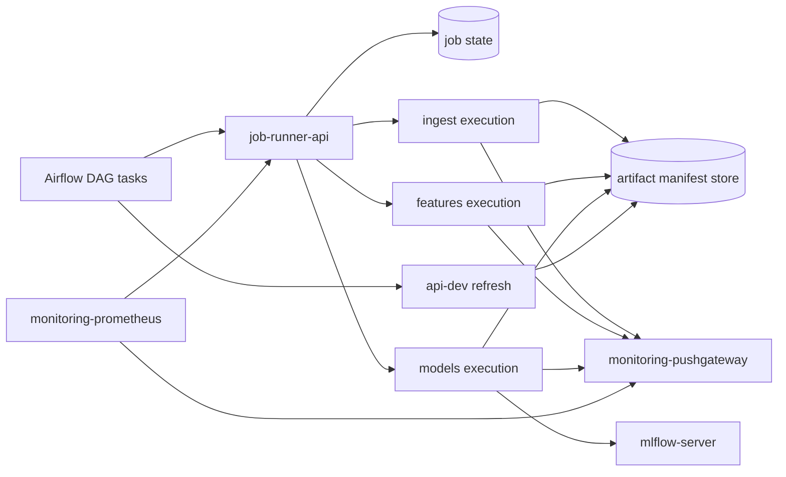

# Airflow job runner strategy

This document is the Phase 8 target design for replacing DockerOperator-based ML
execution in the local production-like runtime.

Phase 7 already introduced the `docker/prod` runtime, functional networks, and a
production-like Airflow worker without `/var/run/docker.sock`. Phase 8 uses this
document to implement the remaining runner-based execution path.

`docker/dev` intentionally keeps the DockerOperator workflow because it remains
useful for local debugging and broad host visibility. `docker/prod` should use a
narrow job submission interface instead of container-runtime access.

## Scope and inputs

| Source | Use in this design |
| ------ | ------------------ |
| [`../README.md`](../README.md) | Documentation hierarchy and reading order. |
| [`../current-runtime-and-operations/local-prod-runtime.md`](../current-runtime-and-operations/local-prod-runtime.md) | Current dev/prod runtime split and known production-like gaps. |
| [`../architecture-references/runtime-communication-matrix.md`](../architecture-references/runtime-communication-matrix.md) | Current Docker socket execution path, service traffic, and Phase 8 additions. |
| [`../architecture-references/runtime-security-boundaries.md`](../architecture-references/runtime-security-boundaries.md) | Runtime identities, Docker socket risk, non-root targets, and job execution boundary. |
| [`../architecture-references/local-prod-network-topology.md`](../architecture-references/local-prod-network-topology.md) | Implemented functional networks and the `pipeline_runtime_net` boundary. |
| [`artifact-handoff-strategy.md`](artifact-handoff-strategy.md) | Manifest-first artifact handoff contract and remaining plan. |
| [`artifact-manifest-store.md`](artifact-manifest-store.md) | Implemented promotion helpers that runner jobs can call later. |
| [`../current-runtime-and-operations/repository-structure.md`](../current-runtime-and-operations/repository-structure.md) | DAG placement rules and the `docker/dev` versus `docker/prod` split. |
| `docker/dev/airflow/config/variables.json` | Current dev Docker image names, network, MLflow, MinIO, Pushgateway, UID, and GID variables. |
| `docker/dev/airflow/config/connections.json` | Current Airflow HTTP connection to `api-dev`. |
| `docker/dev/airflow/scripts/airflow-init.sh` | Current Airflow variable, connection, and pool bootstrap flow. |
| `docker/dev/airflow/scripts/airflow-entrypoint.sh` | Current root entrypoint used to adjust Docker socket group access in dev. |
| `docker/dev/airflow/config/bike_dag_config.json` | Multi-counter init and daily DAG business configuration. |

This document does not implement the runner, rewrite DAGs, remove the Docker
socket from `docker/dev`, add Kubernetes, or introduce production secrets.

## Current status

Implemented after Phase 7 and the first artifact stories:

- `docker/prod` exists as a local production-like runtime.
- `docker/prod` uses functional networks instead of `mlops_net`.
- `docker/prod` Airflow services do not mount `/var/run/docker.sock`.
- Custom prod-like API and ML images run as non-root users.
- Root `data`, `models`, and `logs` remain development/DVC workspaces.
- Production-like generated outputs use `docker/prod/runtime`.
- Artifact manifest models, emission helpers, and store helpers are implemented
  under `src/artifacts`.
- Ingest, features, and model ML steps can emit coherent local artifact
  manifests through service-specific wrappers.
- Typed pipeline job request and status contracts are implemented under
  `src/pipeline/contracts`.

Remaining runner work:

- internal `job-runner-api`;
- runner execution path;
- production-like Airflow DAG variant using the runner;
- artifact-aware API serving;
- production-like smoke validation.

The artifact-specific plan is centralized in
[`artifact-handoff-strategy.md`](artifact-handoff-strategy.md).

## Decision summary

The preferred local production-like target is a controlled internal job runner
composed of:

1. a small internal job API;
2. a simple job state model;
3. typed ML worker execution paths;
4. an allow-list of supported job types and arguments;
5. explicit artifact handoff and observability contracts.

Airflow should submit and observe jobs. It should not create containers through
the host Docker socket in the production-like runtime.

This target keeps the architecture translatable to Kubernetes Jobs or CronJobs
later without forcing Kubernetes into the local Compose runtime.

Ingestion, feature engineering, and model training must remain separate business
microservices. They may share a common runner protocol, common schemas, and a
common base image pattern, but they should not be collapsed into a single generic
ML service.

## Current Airflow-triggered execution model in development

The current local development model uses Airflow as both orchestrator and
container launcher:

1. Airflow imports variables and connections during `airflow-init`.
2. DAG tasks read Docker image names, network names, MLflow endpoints, MinIO
   credentials, Pushgateway address, and UID/GID values from Airflow variables.
3. The development Airflow worker mounts `/var/run/docker.sock`.
4. The development Airflow worker starts ML containers for ingestion, feature
   engineering, training, and prediction.
5. ML containers read and write shared `data`, `logs`, and `models` paths.
6. Model jobs log run evidence to MLflow and push batch metrics to Pushgateway.
7. Airflow calls the FastAPI admin refresh endpoint after successful runs.

This model is practical for local development because it reuses existing Docker
images and keeps artifacts visible on the host. It is not a production-like job
boundary and should remain dev-only.

## Why broad container-runtime access is not production-like

A container with write access to the Docker socket can ask the host Docker daemon
to create containers, mount host paths, join networks, and access data or secrets
available to the daemon.

The development `airflow-worker` therefore mixes two responsibilities:

- orchestration: schedule tasks, track dependencies, expose retries, and keep DAG state;
- execution control: create runtime containers with host-level Docker privileges.

| Concern | Development behavior | Production-like target behavior |
| ------- | -------------------- | ------------------------------- |
| Privilege boundary | Airflow worker can control the host container runtime. | Airflow can call only a narrow job submission interface. |
| Runtime user | Worker uses a root entrypoint to align Docker socket access. | Airflow and ML workers run without Docker socket access. |
| Network scope | Jobs inherit networks selected by Airflow variables. | Jobs run on predefined functional networks. |
| Command scope | DAG code can construct container commands. | Runner accepts only allow-listed job types and arguments. |
| Artifact scope | Jobs write broad host-mounted folders. | Jobs publish through manifest-first artifact handoff. |
| Observability | DockerOperator status is mixed with container logs. | Runner exposes job state, retries, logs, and metrics. |

## Workload model

The runner must cover the existing ML pipeline shape:

| Job type | Current dev image or action | Main outputs | External dependencies |
| -------- | --------------------------- | ------------ | --------------------- |
| `ingest` | `ml-ingest-dev` | interim data, manifest, and ingest metrics | raw data, runtime data workspace, logs, Pushgateway |
| `features` | `ml-features-dev` | processed features, manifest, and feature metrics | interim data, runtime data workspace, logs, Pushgateway |
| `models` | `ml-models-dev` | forecasts, model artifacts, MLflow runs, prediction manifest | processed data, runtime data/model workspace, logs, MLflow, Pushgateway |
| `api_refresh` | `api-dev` HTTP admin call | refreshed serving cache | FastAPI service and API credentials |

The init and daily DAGs should keep their business responsibility: choose
counters, derive ranges or dates, trigger jobs in the right order, and decide
whether downstream refresh is allowed. They should stop owning container runtime
details.

## Selected target architecture



The diagram is a target design. It should be implemented through the remaining
Phase 8 stories, not treated as current `docker/prod` behavior.

## Typed job contracts

The initial framework-neutral contracts are implemented under:

```text
src/pipeline/contracts/
├── __init__.py
├── jobs.py
└── statuses.py
```

They are Pydantic models used to describe the payloads that Airflow, the future
runner API, and typed ML workers exchange. They deliberately do not import
Airflow, Docker SDK, FastAPI application instances, or runner implementation
code.

Implemented request contracts include:

- `IngestJobRequest`;
- `FeatureJobRequest`;
- `ModelJobRequest`;
- `PipelineJobRequest`.

Implemented status and result contracts include:

- `JobStatus`;
- `JobResult`;
- `JobError`;
- `MetricsEvidence`.

`PipelineJobRequest` validates that related ingest, features, and model steps
share `run_id`, `counter_id`, and `manifest_root`, and that their handoff paths
match in order: ingest interim output, features input/output, and model input.

## Runner API

Airflow submits a typed job request to `job-runner-api`. The request includes:

- `dag_id`;
- `task_id`;
- `run_id`;
- `try_number`;
- `counter_id`;
- `job_type`;
- validated business parameters;
- expected input and output artifact references.

The API validates the request, assigns a `job_id`, records job state, and starts
or dispatches execution. Airflow receives `job_id` and observes the job until it
reaches a terminal state.

The first implementation can use in-memory state if it remains clear that this is
a local production-like bridge, not a durable distributed queue.

## Worker execution

The first implementation target should use typed execution paths from the start:

| Worker or execution path | Accepted jobs | Service-specific constraints |
| ------------------------ | ------------- | ---------------------------- |
| Ingestion execution | `ingest` only | Raw and interim data access, ingest configuration, Pushgateway metrics. |
| Feature execution | `features` only | Interim and processed data access, feature configuration, Pushgateway metrics. |
| Model execution | `models` only | Processed/final data, model artifacts, MLflow, optional MinIO/S3 credentials, Pushgateway metrics. |

The execution paths may share a common job protocol:

- validate the job payload with a typed schema;
- resolve a safe command from an allow-list;
- execute the business entrypoint;
- publish status, logs, metrics, and artifact references.

They should not share one broad runtime configuration. Service-specific
dependencies, environment variables, mounted paths, network attachments, health
checks, and resource limits should remain explicit per worker or per job type.

## Job state model

The runner should expose a small state machine:

| State | Meaning | Airflow behavior |
| ----- | ------- | ---------------- |
| `submitted` | Request was accepted and recorded. | Continue polling. |
| `queued` | Job is waiting for execution. | Continue polling or sensor deferral. |
| `running` | Execution started. | Continue polling and link logs. |
| `succeeded` | Command exited successfully and outputs were published. | Mark task successful. |
| `failed` | Command failed with a controlled error. | Fail the Airflow attempt. |
| `canceled` | Job was canceled by operator or cleanup policy. | Fail or skip according to DAG policy. |
| `expired` | Job exceeded retention or timeout. | Fail with an explicit timeout reason. |

Airflow retries should create distinct external attempts by including
`try_number` in the idempotency key. Re-submitting the same key should return the
existing `job_id` instead of duplicating work.

## Impact on Airflow DAGs

Development DAG responsibility:

- build container commands;
- select Docker images and networks;
- pass MLflow, MinIO, Pushgateway, UID, and GID variables;
- wait for the container exit code;
- call API refresh after successful jobs.

Production-like DAG responsibility:

- build typed business job specs;
- submit jobs to `job-runner-api`;
- wait for runner terminal state;
- map runner failure to Airflow failure;
- call API refresh through the existing HTTP connection;
- preserve DAG-level retry, schedule, and dependency semantics.

DAG code should stay near Airflow runtime assets under `docker/dev` or
`docker/prod` unless the project later decides to package DAGs as importable
application modules. Reusable client or schema logic may live under `src/` with
tests, but deployment-specific DAG wiring should remain close to the Airflow
runtime that consumes it.

## Init and daily DAG trigger flow

### Initial load DAG

1. Read `bike_dag_config.json`.
2. For each configured counter, submit `ingest`.
3. Submit `features` only after the matching ingest job succeeds.
4. Submit `models` only after the matching feature job succeeds.
5. Promote or refresh final prediction data only after required model outputs are promoted.
6. Fail the Airflow run if any required runner job fails.

### Daily DAG

1. Compute the daily range or business window.
2. Submit `ingest` with the daily range and counter configuration.
3. Submit `features` and `models` with the same idempotency context.
4. Promote or refresh final prediction data only after successful model jobs.
5. Keep Airflow retries at the orchestration layer while the runner records every
   external job attempt.

In both flows, Airflow never asks Docker to start a container. It only asks the
job runner to execute an allowed job type.

## Phase 8 story mapping

| Story | Role | Status |
| ----- | ---- | ------ |
| #64 | Implement artifact manifest models used by job results. | Implemented. |
| #65 | Implement manifest writer and promotion helpers. | Implemented. |
| #66 | Make ML jobs emit artifact manifests. | Implemented for local manifests. |
| #67 | Implement typed pipeline job contracts. | Implemented. |
| #68 | Add the internal `job-runner-api` skeleton. | Remaining. |
| #69 | Execute typed ML jobs through the runner. | Remaining. |
| #70 | Add the production-like Airflow DAG using the runner API. | Remaining. |
| #71 | Make the API serve promoted artifacts from manifests. | Remaining. |
| #72 | Add production-like smoke validation. | Remaining. |
| #73 | Harden runtime configuration and secrets validation. | Remaining. |

The artifact handoff status table in
[`artifact-handoff-strategy.md`](artifact-handoff-strategy.md) is the canonical
remaining-plan reference for artifact promotion work.

## Validation target

A complete Phase 8 validation should eventually prove that:

- `docker/prod` Airflow has no Docker socket mount;
- Airflow can submit a typed job to `job-runner-api`;
- the runner can execute the pipeline or a single step without exposing the
  Docker socket to Airflow;
- each ML step emits coherent artifact manifests;
- the API serves predictions by reading the promoted manifest;
- Prometheus/Grafana can observe job status and artifact freshness.

Until the runner API exists, validate this story with unit tests covering the
Pydantic contracts and manifest coherence across ML steps.
