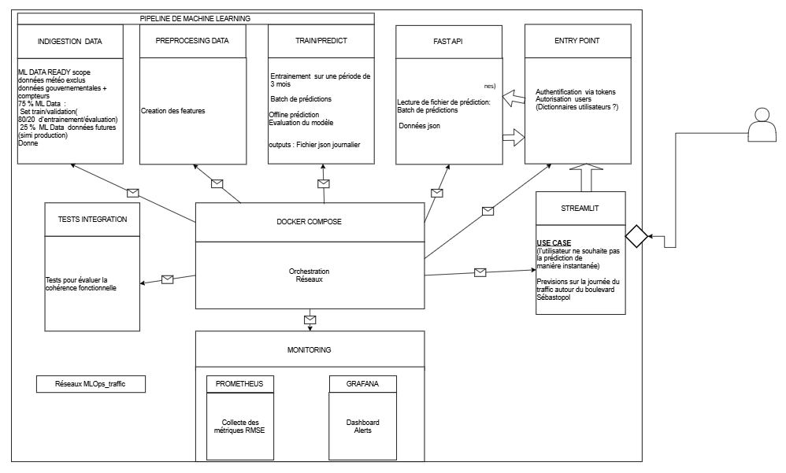

# Architecture MLOPS

Cette architecture met en exergue les interactions entre les différents composants pour répondre au besoin inital de prédiction du traffic cycliste voulu par un utilisateur.

Lien pour collaborer de manière active : [Architecture_MLOps](https://drive.google.com/drive/folders/1x0bYLAPDL7VjPavHJBZ4jAG6zUeo6tUO)

