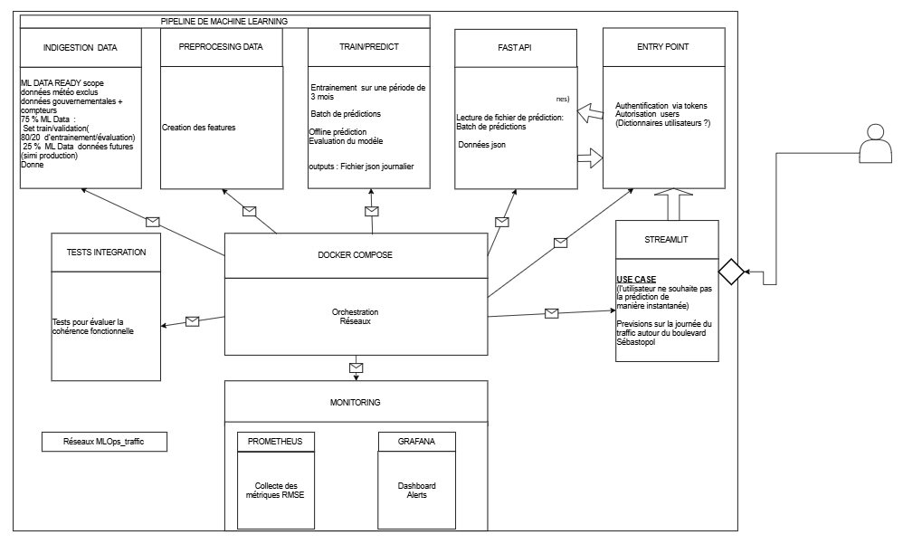

Liens pour collaborer de manière active 

[Architecture_MLOps_v2](https://drive.google.com/drive/folders/1x0bYLAPDL7VjPavHJBZ4jAG6zUeo6tUO)

Architecture_MLOps_v2: 

Cette architecture met en exergue les interactions entre  les différents composants pour répondre au besoin inital de prédiction du traffic cycliste voulu par un utilisateur

